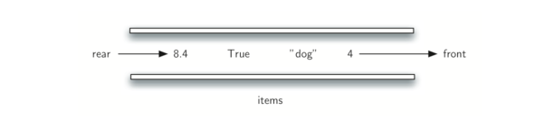

# 什么是队列

队列是项的有序结合，其中添加新项的一端称为队尾，移除项的一端称为队首。当一个元素从队尾进入队列时，一直向队首移动，直到它成为下一个需要移除的元素为止。

最近添加的元素必须在队尾等待。集合中存活时间最长的元素在队首，这种排序成为 FIFO，先进先出，也被成为先到先得。

队列的最简单的例子是我们平时不时会参与的列。排队等待电影，在杂货店的收营台等待，在自助餐厅排队等待（这样我们可以弹出托盘栈）。行为良好的线或队列是有限制的，因为它只有一条路，只有一条出路。不能插队，也不能离开。你只有等待了一定的时间才能到前面。Figure 1 展示了一个简单的 Python 对象队列。



**Figure 1**

计算机科学也有常见的队列示例。我们的计算机实验室有 30 台计算机与一台打印机联网。当学生想要打印时，他们的打印任务与正在等待的所有其他打印任务“一致”。第一个进入的任务是先完成。如果你是最后一个，你必须等待你前面的所有其他任务打印。我们将在后面更详细地探讨这个有趣的例子。

除了打印队列，操作系统使用多个不同的队列来控制计算机内的进程。下一步做什么的调度通常基于尽可能快地执行程序和尽可能多的服务用户的排队算法。此外，当我们敲击键盘时，有时屏幕上出现的字符会延迟。这是由于计算机在那一刻做其他工作。按键的内容被放置在类似队列的缓冲器中，使得它们最终可以以正确的顺序显示在屏幕上。

# 队列抽象数据类型

队列抽象数据类型由以下结构和操作定义。如上所述，队列被构造为在队尾添加项的有序集合，并且从队首移除。队列保持 FIFO 排序属性。 队列操作如下。

- Queue() 创建一个空的新队列。 它不需要参数，并返回一个空队列。

- enqueue(item) 将新项添加到队尾。 它需要 item 作为参数，并不返回任何内容。

- dequeue() 从队首移除项。它不需要参数并返回 item。 队列被修改。

- isEmpty() 查看队列是否为空。它不需要参数，并返回布尔值。

- size() 返回队列中的项数。它不需要参数，并返回一个整数。作为示例，我们假设 q 是已经创建并且当前为空的队列，则 Table 1 展示了队列操作序列的结果。右边表示队首。 4 是第一个入队的项，因此它 dequeue 返回的第一个项。


**Table 1**

# Python实现队列

```python
# coding=utf-8
class Queue:
    def __init__(self):
        self.items = []
    def isEmpty(self):
        return self.items == []
    def enqueue(self, item):
        self.items.append(item)
    def dequeue(self):
        return self.items.pop(0)
    def size(self):
        return len(self.items)
if __name__ == '__main__':
    q = Queue()
    q.enqueue("张三")
    q.enqueue("李四")
    q.enqueue("王五")
    print(q.size())
    print(q.dequeue())
    print(q.dequeue())
    print(q.dequeue())
#
3
张三
李四
王五
```

# 2、使用模块

```python
# coding=utf-8
from pythonds.basic.queue import Queue
if __name__ == '__main__':
    q = Queue()
    q.enqueue("张三")
    q.enqueue("李四")
    q.enqueue("王五")
    print(q.size())
    print(q.dequeue())
    print(q.dequeue())
    print(q.dequeue())
#
3
张三
李四
王五
```