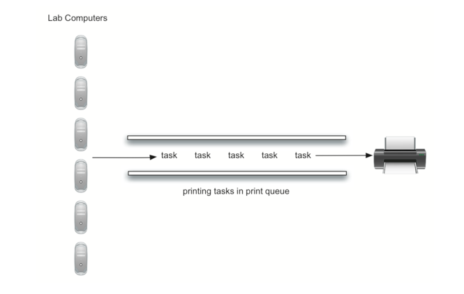
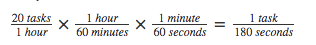

## 模拟：打印机

一个更有趣的模拟是允许我们研究本节前面描述的打印机的行为，回想一下，当学生向共享打印机发送打印任务时，任务被放置在队列中以便以先来先服务的方式被处理。此配置会出现许多问题。其中最重要的点可能是打印机是否能够处理一定量的工作。如果它不能，学生将等待太长时间打印，可能会错过他们的下一节课。

在计算机科学实验室里考虑下面的情况。平均每天大约10名学生在任何给定时间在实验室工作。这些学生通常在此期间打印两次，这些任务的长度范围从1到20页。实验室中的打印机较旧，每分钟以草稿质量可以处理10页。打印机可以切换以提供更好的质量，但是它将每分钟只能处理五页。较慢的打印速度可能会使学生等待太久。应使用什么页面速率？

我们可以通过建立一个模拟实验来决定。我们将需要为学生，打印任务和打印机构建表现表示（Figure 4）。当学生提交打印任务时，我们将把他们添加到等待列表中，一个打印任务的队列。 当打印机完成任务时，它将检查队列，以检查是否有剩余的任务要处理。我们感兴趣的是学生等待他们的论文打印的平均时间。这等于任务在队列中等待的平均时间量。



**Figure 4**

为了为这种情况建模，我们需要使用一些概率。例如，学生可以打印长度从 1 到 20 页的纸张。如果从 1 到 20 的每个长度有同样的可能性，则可以通过使用 1 和 20 之间的随机数来模拟打印任务的实际长度。这意味着出现从 1 到 20 的任何长度的机会是平等的。

如果实验室中有 10 个学生，每人打印两次，则平均每小时有 20 个打印任务。 在任何给定的秒，打印任务将被创建的机会是什么？ 回答这个问题的方法是考虑任务与时间的比率。每小时 20 个任务意味着平均每 180 秒将有一个任务：



对于每一秒，我们可以通过生成 1 到 180 之间的随机数来模拟打印任务发生的机会。如果数字是 180，我们说一个任务已经创建。请注意，可能会在一下子创建许多任务，或者需要等待一段时间才有任务。这就是模拟的本质。你想模拟真实的情况就需要尽可能接近一般参数。

- 创建打印任务的队列，每个任务都有个时间戳。队列启动的时候为空。

- 当前时间（currentSecond）：

- 是否创建新的打印任务？如果是，将 currentSecond  作为时间戳添加到队列。

- 如果打印机不忙并且有任务在等待

- 从打印机队列中删除一个任务并将其分配给打印机

- 从 currentSecond 中减去时间戳，以计算该任务的等待时间。

- 将该任务的等待时间附件到列表中稍后处理。

- 根据打印任务的页数，确定需要多少时间。

- 打印机需要一秒打印，所以得从该任务的所需的等待时间减去一秒。

- 如果任务已经完成，换句话说，所需的时间已经达到零，打印机空闲。

- 模拟完成后，从生成的等待时间列表中计算平均等待时间。

为了设计此模拟，我们将为上述三个真实世界对象创建类：

- Printer 类需要跟踪它当前是否有任务。如果有，则它处于忙碌状态，并且可以从任务的页数计算所需的时间。构造函数允许初始化每分钟页面的配置，tick 方法将内部定时器递减直到打印机设置为空闲。

- Task 类表示单个打印任务。创建任务时，随机数生成器将提供 1 到 20 页的长度。我们选择使用随机模块中的 randrange 函数。每个任务还需要保存一个时间戳用于计算等待时间。此时间戳将表示任务被创建并放置到打印机队列中的时间。可以使用 waitTime 方法来检索在打印开始之前队列中花费的时间。

- PrintQueue 对象是我们现有队列 ADT 的一个实例。newPrintTask 决定是否创建一个新的打印任务。我们再次选择使用随机模块的 randrange 函数返回 1 到 180 之间的随机整数。打印任务每 180 秒到达一次。通过从随机整数（32 行）的范围中任意选择，我们可以模拟这个随机事件。模拟功能允许我们设置打印机的总时间和每分钟的页数。

```python
# coding=utf-8
from pythonds.basic.queue import Queue
import random
class Printer:
    def __init__(self, ppm):
        # pages per minute. 打印机每分钟能够打印的纸张页数。
        self.pagerate = ppm
        self.currentTask = None
        # 当前任务距离完成还需要的时间
        self.timeRemaining = 0
    # 模拟打印机工作，当剩余时间为0时，任务完成
    def tick(self):
        if self.currentTask != None:
            self.timeRemaining = self.timeRemaining - 1
            if self.timeRemaining <= 0:
                self.currentTask = None
    def busy(self):
        if self.currentTask != None:
            return True
        else:
            return False
    def startNext(self, newtask):
        self.currentTask = newtask
        # 计算任务需要的时间,单位秒，* 60 就是把分钟转为秒
        self.timeRemaining = newtask.getPages() / self.pagerate * 60
class Task:
    def __init__(self, time):
        # 任务生成的时间
        self.timestamp = time
        self.pages = random.randrange(1, 21)
    def getStamp(self):
        return self.timestamp
    def getPages(self):
        return self.pages
    def waitTime(self, currenttime):
        return currenttime - self.timestamp
def simulation(numSeconds, pagesPerMinute):
    """
    :param numSeconds: 模拟的时长，单位秒。
    :param pagesPerMinute:   设置打印机每分钟能够打印的纸张页数。
    :return:
    """
    labprinter = Printer(pagesPerMinute)
    printQueue = Queue()
    waitingtimes = []
    # 使用for循环，模拟一小时
    for currentSecond in range(numSeconds):
        # 随机生成打印任务，如果是180，则生成一个新的打印任务
        # 模拟某一时刻，是否会有人来打印
        if newPrintTask():
            # 生成打印任务，currentSecond为任务生成的时间
            task = Task(currentSecond)
            printQueue.enqueue(task)
        # 如果打印机空闲，并且打印队列不为空，则开始打印任务
        if (not labprinter.busy()) and (not printQueue.isEmpty()):
            nexttask = printQueue.dequeue()
            waitingtimes.append(nexttask.waitTime(currentSecond))
            # 将这个任务推送给打印机
            labprinter.startNext(nexttask)
        # 打印机开始执行打印任务
        labprinter.tick()
    averageWait = sum(waitingtimes) / len(waitingtimes)
    print("Average Wait %6.2f secs %3d tasks remaining." % (averageWait, printQueue.size()))
def newPrintTask():
    num = random.randrange(1, 181)
    if num == 180:
        return True
    else:
        return False
for i in range(10):
    simulation(3600, 5)
```

当我们运行模拟时，我们不应该担心每次的结果不同。这是由于随机数的概率性质决定的。 因为模拟的参数可以被调整，我们对调整后可能发生的趋势感兴趣。 这里有一些结果。

首先，我们将使用每分钟五页的页面速率运行模拟 60 分钟（3,600秒）。 此外，我们将进行 10 次独立试验。记住，因为模拟使用随机数，每次运行将返回不同的结果。

```shell
Average Wait 141.65 secs   0 tasks remaining.
Average Wait  71.71 secs   2 tasks remaining.
Average Wait 185.11 secs   2 tasks remaining.
Average Wait  71.42 secs   0 tasks remaining.
Average Wait 130.37 secs   0 tasks remaining.
Average Wait 204.53 secs   5 tasks remaining.
Average Wait  88.35 secs   3 tasks remaining.
Average Wait  21.25 secs   0 tasks remaining.
Average Wait  88.42 secs   0 tasks remaining.
Average Wait  61.29 secs   0 tasks remaining.
```