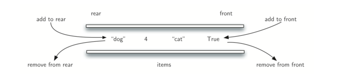
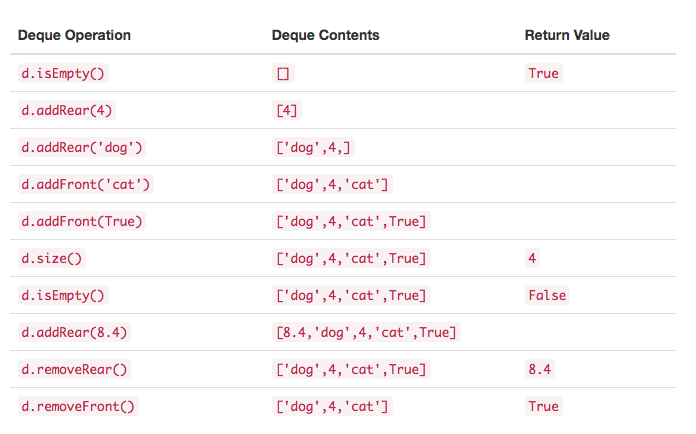

## 什么是Deque

deque（也称为双端队列）是与队列类似的项的有序集合。它有两个端部，首部和尾部，并且项在集合中保持不变。deque 不同的地方是添加和删除项是非限制性的。可以在前面或后面添加新项。同样，可以从任一端移除现有项。在某种意义上，这种混合线性结构提供了单个数据结构中的栈和队列的所有能力。 Figure 1 展示了一个 Python 数据对象的 deque 。

要注意，即使 deque 可以拥有栈和队列的许多特性，它不需要由那些数据结构强制的 LIFO 和 FIFO 排序。这取决于你如何持续添加和删除操作。



**Figure 1**

## Deque抽象数据类型

deque 抽象数据类型由以下结构和操作定义。如上所述，deque 被构造为项的有序集合，其中项从首部或尾部的任一端添加和移除。下面给出了 deque 操作。

- Deque() 创建一个空的新 deque。它不需要参数，并返回空的 deque。

- addFront(item) 将一个新项添加到 deque 的首部。它需要 item 参数 并不返回任何内容。

- addRear(item) 将一个新项添加到 deque 的尾部。它需要 item 参数并不返回任何内容。

- removeFront() 从 deque 中删除首项。它不需要参数并返回 item。deque 被修改。

- removeRear() 从 deque 中删除尾项。它不需要参数并返回 item。deque 被修改。

- isEmpty() 测试 deque 是否为空。它不需要参数，并返回布尔值。

- size() 返回 deque 中的项数。它不需要参数，并返回一个整数。例如，我们假设 d 是已经创建并且当前为空的 deque，则 Table 1 展示了一系列 deque 操作的结果。注意，首部的内容列在右边。在将 item 移入和移出时，跟踪前面和后面是非常重要的，因为可能会有点混乱。



**Table 1**

## Python实现Deque

正如我们在前面的部分中所做的，我们将为抽象数据类型 deque 的实现创建一个新类。同样，Python 列表将提供一组非常好的方法来构建 deque 的细节。我们的实现（Listing 1）将假定 deque 的尾部在列表中的位置为 0。

```python
# coding=utf-8
class Deque:
    def __init__(self):
        self.items = []
    def isEmpty(self):
        return self.items == []
    def addFront(self, e):
        self.items.append(e)
    def addRear(self, e):
        self.items.insert(0, e)
    def removeFront(self):
        return self.items.pop()
    def removeRear(self):
        return self.items.pop(0)
    def size(self):
        return len(self.items)
```