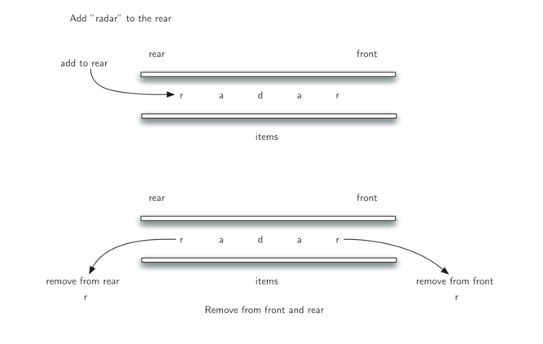

## 回文检查

使用 deque 数据结构可以容易地解决经典回文问题。回文是一个字符串，读取首尾相同的字符，例如，

该问题的解决方案将使用 deque 来存储字符串的字符。我们从左到右处理字符串，并将每个字符添加到 deque 的尾部。在这一点上，deque 像一个普通的队列。然而，我们现在可以利用 deque 的双重功能。 deque 的首部保存字符串的第一个字符，deque 的尾部保存最后一个字符（见 Figure 2）。



**Figure 2**

我们可以直接删除并比较首尾字符，只有当它们匹配时才继续。如果可以持续匹配首尾字符，我们最终要么用完字符，要么留出大小为 1 的deque，取决于原始字符串的长度是偶数还是奇数。在任一情况下，字符串都是回文。 回文检查的完整功能在 ActiveCode 1 中。

```python
from pythonds.basic.deque import Deque
def palchecker(aString):
    chardeque = Deque()
    for ch in aString:
        chardeque.addRear(ch)
    stillEqual = True
    while chardeque.size() > 1 and stillEqual:
        first = chardeque.removeFront()
        last = chardeque.removeRear()
        if first != last:
            stillEqual = False
    return stillEqual
print(palchecker("lsdkjfskf"))
print(palchecker("radar"))
#
False
True
```

**ActiveCode 1**