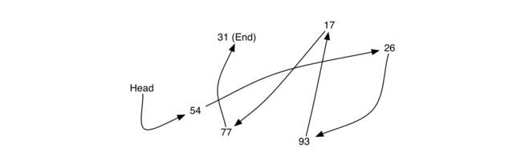
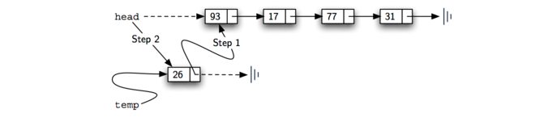
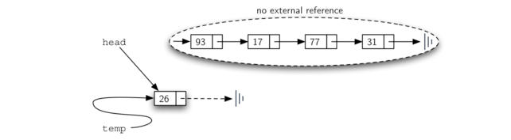
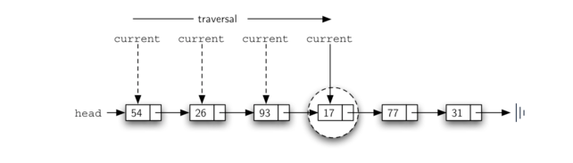
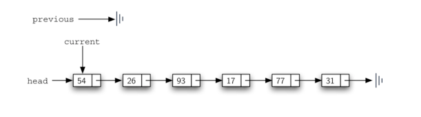
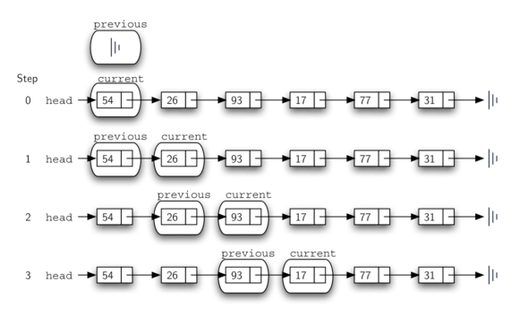
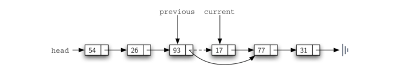
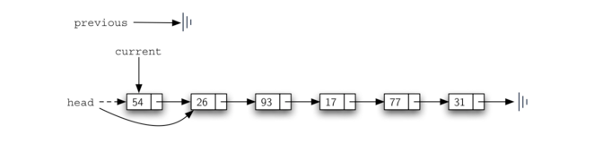

为了实现无序列表，我们将构造通常所知的链表。回想一下，我们需要确保我们可以保持项的相对定位。然而，没有要求我们维持在连续存储器中的定位。例如，考虑 Figure 1 中所示的项的集合。看来这些值已被随机放置。如果我们可以在每个项中保持一些明确的信息，即下一个项的位置（参见 Figure 2），则每个项的相对位置可以通过简单地从一个项到下一个项的链接来表示。


**Figure 1**



**Figure 2**

要注意，必须明确地指定链表的第一项的位置。一旦我们知道第一个项在哪里，第一个项目可以告诉我们第二个是什么，等等。外部引用通常被称为链表的头。类似地，最后一个项需要知道没有下一个项。

链表实现的基本构造块是节点。每个节点对象必须至少保存两个信息。首先，节点必须包含列表项本身。我们将这个称为节点的数据字段。此外，每个节点必须保存对下一个节点的引用。 Listing 1 展示了 Python 实现。要构造一个节点，需要提供该节点的初始数据值。下面的赋值语句将产生一个包含值 93 的节点对象（见 Figure 3）。应该注意，我们通常会如 Figure 4 所示表示一个节点对象。Node 类还包括访问，修改数据和访问下一个引用的常用方法。

```python
class Node:
    """数据节点"""
    def __init__(self, initdata):
        self.data = initdata
        self.next = None
    def getData(self):
        return self.data
    def getNext(self):
        return self.next
    def setData(self, newdata):
        self.data = newdata
    def setNext(self, newnext):
        self.next = newnext
```

Python 引用值 None 将在 Node 类和链表本身发挥重要作用。引用 None 代表没有下一个节点。请注意在构造函数中，最初创建的节点 next 被设置为 None。有时这被称为 


**Figure 3**


**Figure 4**

如上所述，无序列表将从一组节点构建，每个节点通过显式引用链接到下一个节点。只要我们知道在哪里找到第一个节点（包含第一个项），之后的每个项可以通过连续跟随下一个链接找到。考虑到这一点，UnorderedList 类必须保持对第一个节点的引用。Listing 2 显示了构造函数。注意，每个链表对象将维护对链表头部的单个引用。

```python
class UnorderedList:
    """无序列表"""
    def __init__(self):
        # 头结点
        self.head = None
```

**Listing 2**

我们构建一个空的链表。赋值语句

```python
>>>mylist = UnorderedList()
```

创建如 Figure 5 所示的链表。正如我们在 Node 类中讨论的，特殊引用 None 将再次用于表示链表的头部不引用任何内容。最终，先前给出的示例列表如 Figure 6 所示的链接列表表示。链表的头指代列表的第一项的第一节点。反过来，该节点保存对下一个节点（下一个项）的引用，等等。重要的是注意链表类本身不包含任何节点对象。相反，它只包含对链接结构中第一个节点的单个引用。


**Figure 5**


**Figure 6**

Listing 3 中所示的 isEmpty 方法只是检查链表头是否是 None 的引用。 布尔表达式 self.head == None 的结果只有在链表中没有节点时才为真。由于新链表为空，因此构造函数和空检查必须彼此一致。这显示了使用引用 None 来表示链接结构的 

```python
def isEmpty(self):
    return self.head == None
```

**Listing 3**

那么，我们如何将项加入我们的链表？我们需要实现 add 方法。然而，在我们做这一点之前，我们需要解决在链表中哪个位置放置新项的重要问题。由于该链表是无序的，所以新项相对于已经在列表中的其他项的特定位置并不重要。 新项可以在任何位置。考虑到这一点，将新项放在最简单的位置是有意义的。

回想一下，链表结构只为我们提供了一个入口点，即链表的头部。所有其他节点只能通过访问第一个节点，然后跟随下一个链接到达。这意味着添加新节点的最简单的地方就在链表的头部。 换句话说，我们将新项作为链表的第一项，现有项将需要链接到这个新项后。

Figure 6 展示了链表调用多次 add 函数的操作

```python
>>> mylist.add(31)
>>> mylist.add(77)
>>> mylist.add(17)
>>> mylist.add(93)
>>> mylist.add(26)
>>> mylist.add(54)
```

**Figure 6**

因为 31 是添加到链表的第一个项，它最终将是链表中的最后一个节点，因为每个其他项在其前面添加。此外，由于 54 是添加的最后一项，它将成为链表的第一个节点中的数据值。

add 方法如 Listing 4 所示。链表的每项必须驻留在节点对象中。第 2 行创建一个新节点并将该项作为其数据。现在我们必须通过将新节点链接到现有结构中来完成该过程。这需要两个步骤，如 Figure 7 所示。步骤1（行3）更改新节点的下一个引用以引用旧链表的第一个节点。现在，链表的其余部分已经正确地附加到新节点，我们可以修改链表的头以引用新节点。第 4 行中的赋值语句设置列表的头。

上述两个步骤的顺序非常重要。如果第 3 行和第 4 行的顺序颠倒，会发生什么？如果链表头部的修改首先发生，则结果可以在 Figure 8 中看到。由于 head 是链表节点的唯一外部引用，所有原始节点都将丢失并且不能再被访问。

```python
def add(self, item):
    temp = Node(item)
    # 把当前head的next指向temp
    temp.setNext(self.head)
    # 重新对head进行赋值
    self.head = temp
```

**Listing 4**



**Figure 7**



**Figure 8**

我们将实现的下面的方法 - 

要实现 

```python
def size(self):
    current = self.head
    count = 0
    while current != None:
        count += 1
        current = current.getNext()
    return count
```

**Figure 9**

在链表中搜索也使用遍历技术。当我们访问链表中的每个节点时，我们将询问存储在其中的数据是否与我们正在寻找的项匹配。然而，在这种情况下，我们不必一直遍历到列表的末尾。事实上，如果我们到达链表的末尾，这意味着我们正在寻找的项不存在。此外，如果我们找到项，没有必要继续。

Listing 6 展示了搜索方法的实现。和在 

```python
def search(self, item):
    current = self.head
    found = False
    while current != None and not found:
        if current.getData() == item:
            found = True
        else:
            current = current.getNext()
    return found
```

**Listing 6**

作为一个例子，试试调用 

```shell
>>> mylist.search(17)
True
```

因为 17 在列表中，所以遍历过程需要移动到包含 17 的节点。此时，



**Figure 10**

remove

当 

为了删除包含项的节点，我们需要修改上一个节点中的链接，以便它指向当前之后的节点。不幸的是，链表遍历没法回退。因为 

这个困境的解决方案是在我们遍历链表时使用两个外部引用。

Listing 7 展示了完整的 

在第 6-7 行中，我们检查存储在当前节点中的项是否是我们希望删除的项。如果是，

```python
def remove(self, item):
    current = self.head
    previous = None
    found = False
    while current != None and not found:
        if current.getData() == item:
            found = True
        else:
            previous = current
            current = current.getNext()
    if found:
        if previous == None:
            self.head = current.getNext()
        else:
            previous.setNext(current.getNext())
```

**Listing 7**



**Figure 11**



**Figure 12**

一旦 



**Figure 13**



**Figure 14**

第 12 行检查是否处理上述的特殊情况。如果 

# python 完整实现

```python
# coding=utf-8
class Node:
    """数据节点"""
    def __init__(self, initdata):
        self.data = initdata
        self.next = None
    def getData(self):
        return self.data
    def getNext(self):
        return self.next
    def setData(self, newdata):
        self.data = newdata
    def setNext(self, newnext):
        self.next = newnext
class UnorderedList:
    """无序列表"""
    def __init__(self):
        # 头结点
        self.head = None
    def isEmpty(self):
        return self.head == None
    def add(self, item):
        temp = Node(item)
        # 把当前head的next指向temp
        temp.setNext(self.head)
        # 重新对head进行赋值
        self.head = temp
    def size(self):
        current = self.head
        count = 0
        while current != None:
            count += 1
            current = current.getNext()
        return count
    def search(self, item):
        current = self.head
        found = False
        while current != None and not found:
            if current.getData() == item:
                found = True
            else:
                current = current.getNext()
        return found
    def printList(self):
        current = self.head
        while current != None:
            print(current.getData())
            current = current.getNext()
    def remove(self, item):
        current = self.head
        previous = None
        found = False
        while current != None and not found:
            if current.getData() == item:
                found = True
            else:
                previous = current
                current = current.getNext()
        if found:
            if previous == None:
                self.head = current.getNext()
            else:
                previous.setNext(current.getNext())
```