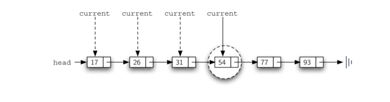
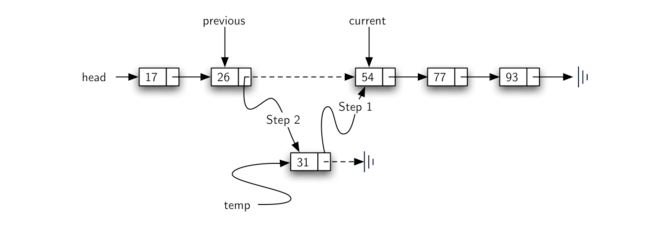

## 实现有序列表

为了实现有序列表，我们必须记住项的相对位置是基于一些潜在的特性。上面给出的整数的有序列表


**Figure 15**

为了实现 OrderedList 类，我们将使用与前面看到的无序列表相同的技术。再次，

```python
class OrderedList:
    """有序链表"""
    def __init__(self):
        self.head = None
```

**Listing 8**

当我们考虑有序列表的操作时，我们应该注意，

搜索无序列表需要我们一次遍历一个节点，直到找到我们正在寻找的节点或者没找到节点（None）。事实证明，相同的方法在有序列表也有效。然而，在项不在链表中的情况下，我们可以利用该顺序来尽快停止搜索。

例如，Figure 16 展示了有序链表搜索值 45 。从链表的头部开始遍历，首先与 



**Figure 16**

Listing 9 展示了完整的搜索方法。通过添加另一个布尔变量 

```python
def search(self, e):
    current = self.head
    found = False
    stop = False
    while current != None and not found and not stop:
        if current.getData() == e:
            found = True
        else:
            current = current.getNext()
            if current.getData() > e:
                stop = True
    return found
```

**Listing 9**

最重要的需要修改的方法是 

假设我们有由 



**Figure 17**

正如我们看到的无序列表，有必要有一个额外的引用，再次称为 

该方法的其余部分完成 Figure17 所示的两步过程。一旦为该项创建了新节点，剩下的唯一问题是新节点是否将被添加在链表的开始处或某个中间位置。再次，

```python
def add(self, e):
    current = self.head
    previous = None
    stop = False
    while current != None and not stop:
        if current.getData() > e:
            stop = True
        else:
            previous = current
            current = current.getNext()
    temp = Node(e)
    if not previous:
        temp.setNext(self.head)
        self.head = temp
    else:
        temp.setNext(current)
        previous.setNext(temp)
```

### 链表分析

为了分析链表操作的复杂性，我们需要考虑它们是否需要遍历。考虑具有 n 个节点的链表。 

你可能还注意到此实现的性能与早前针对 Python 列表给出的实际性能不同。这表明链表不是 Python 列表的实现方式。 Python 列表的实际实现基于数组的概念。我们在第 8 章中更详细地讨论这个问题。