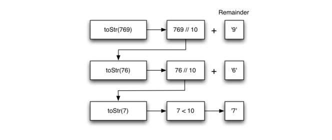
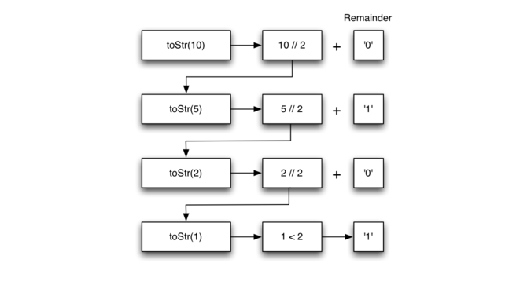

## 堆栈实现进制转换：

## 整数转换为任意进制字符串

假设你想将一个整数转换为一个二进制和十六进制字符串。例如，将整数 

让我们看一个十进制数 

知道我们的基本情况是什么意味着整个算法将分成三个部分：

- 将原始数字减少为一系列单个位数字。

- 使用查找将单个位数字数字转换为字符串。

- 将单个位字符串连接在一起以形成最终结果。下一步是找到改变其状态的方法并向基本情况靠近。由于我们示例为整数，所以考虑什么数学运算可以减少一个数字。最可能的候选是除法和减法。虽然减法可能可以实现，但我们不清楚应该减去多少。使用余数的整数除法为我们提供了一个明确的方向。让我们看看如果我们将一个数字除以我们试图转换的基数，会发生什么。

使用整数除法将 



**Figure 3**

ActiveCode 1 展示了实现上述算法的 Python 代码， 以 2 到 16 之间的任何基数为参数。

```python
# coding=utf-8
def toStr(n, base):
    convertString = "0123456789ABCDEF"
    if n < base:
        return convertString[n]
    else:
        return toStr(n // base, base) + convertString[n % base]
print(toStr(1453, 10))
print(toStr(1453, 2))
print(toStr(1453, 8))
print(toStr(1453, 16))
#
1453
10110101101
2655
5AD
```

请注意，在第 3 行中，我们检查基本情况，其中 n 小于我们要转换的基数。 当我们检测到基本情况时，我们停止递归，并简单地从 convertString 序列返回字符串。 在第 6 行中，我们满足第二和第三定律 - 递归调用和减少除法问题大小。

让我们再次跟踪算法; 这次我们将数字 10 转换为其基数为 2 的字符串（“1010”）。



**Figure 4**

Figure 4 显示我们得到的结果，但看起来数字是错误的顺序。该算法是正确的，因为我们首先在第 6 行进行递归调用，然后我们添加余数的字符串形式。 如果我们反向返回 