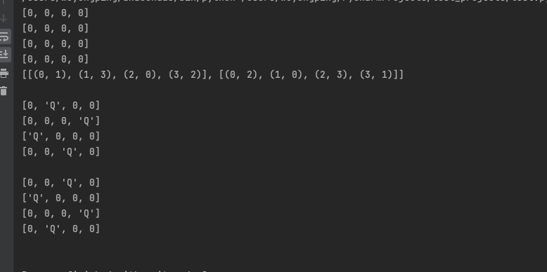

```python
def foo4(length=4):
    nums = [[0] * length for _ in range(length)]
    for item in nums:
        print(item)
    Q = "Q"
    row_record = [False] * length
    state = []
    res = []
    def inner(nums):
        nonlocal state, row_record
        if len(state) == length:
            res.append(list(state))
            return
        for y, row in enumerate(nums):
            if row_record[y]:
                continue
            row_record[y] = True
            for x, col in enumerate(row):
                # 剪枝操作
                for i, j in state:
                    if abs(i - y) == abs(j - x) or i + j == y + x or i == y or j == x:
                        break
                else:
                    nums[y][x] = Q
                    state.append((y, x))
                    inner(nums)
                    # 回溯操作
                    nums[y][x] = 0
                    state.pop()
            row_record[y] = False
            break
    inner(nums)
    # 输出回溯的结果
    print(res)
    print()
    for row in res:
        nums = [[0] * length for _ in range(length)]
        for y, x in row:
            nums[y][x] = Q
        for item in nums:
            print(item)
        print()
```

