# 第十章 二叉树及递归问题讲解

## 10.1 数和二叉树数据结构复习

### 10.1.1 树（Tree）

树是一种

如果

除根结点以外的其他结点划分为

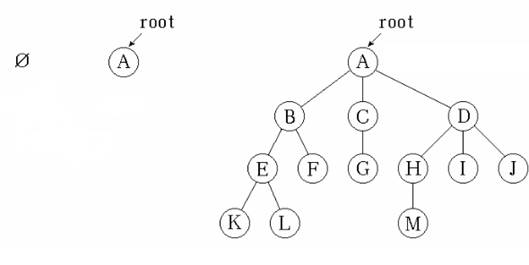

下面是一些其它基本概念：

- **节点的度：**节点拥有的子树个数

- **叶子节点（****leaf****）**：度为0的节点，也就是没有子树的节点

- **树的高度：**树中节点的最大层数，也叫做树的深度

### 10.1.2 二叉树（Binary Tree）

对于树这种数据结构，使用最频繁的是

每个节点最多只有

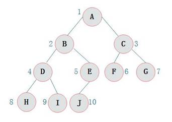

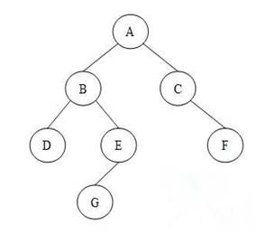

**（**

二叉树有以下性质：

- l  若二叉树的层次从0开始，则在二叉树的第i层至多有2^i个结点(i>=0)

- l  高度为k的二叉树最多有2^(k+1) - 1个结点(k>=-1)(空树的高度为-1)

- l  对任何一棵二叉树，如果其叶子结点(度为0)数为m, 度为2的结点数为n, 则m = n + 1

**（**

l

l

### 10.1.3 递归（Recursion）

对于树结构的遍历和处理，最为常用的代码结构就是

递归是一种重要的编程技术，该方法用来让一个函数（方法）从其内部调用其自身。一个含直接或间接调用本函数语句的函数，被称之为递归函数。

递归的实现有两个必要条件：

l

l

一个简单示例就是计算阶乘：

代码如下：

```
*// **递归示例：计算阶乘*
**public static int **factorial(**int **n){    
    **if **( n == 0 ) **return **1;    
    **return ***factorial*(n - 1) * n;
    }
    *// **尾递归计算阶乘，需要多一个参数保存**“**计算状态**”*
    **public static int **fact(**int **acc, **int **n){    
    **if **( n == 0 ) **return **acc;    
    **return ***fact*( acc * n, n - 1 );
}
```

上面的第二种实现，把递归调用置于函数的末尾，即正好在

### 10.1.4 二叉树的遍历

l

l

l

l

用递归可以很容易地实现二叉树的先序、中序、后序遍历：

- ***遍历二叉树******1******：先序遍历***

```
**public static void **printTreePreOrder( TreeNode root ){    
    **if **(root == **null**) **return**;    
    System.***out***.print(root.**val **+ **"****\t****"**);*     *
    *printTreePreOrder*( root.**left **);*     *    
    *printTreePreOrder*( root.**right **);* *
}
```

#### *遍历二叉树**2**：中序遍历*

```
**public static void **printTreeInOrder( TreeNode root ){    
    **if **(root == **null**) **return**;    
    *printTreeInOrder*( root.**left **);*     *
    System.***out***.print(root.**val **+ **"****\t****"**);*     *
    *printTreeInOrder*( root.**right **);* *
}
```

#### *遍历二叉树**3**：后序遍历*

```
**public static void **printTreePostOrder( TreeNode root ){    
    **if **(root == **null**) **return**;    
    *printTreePostOrder*( root.**left **);*     *
    *printTreePostOrder*( root.**right **);*     *
    System.***out***.print(root.**val **+ **"****\t****"**);* *
}
```

层序遍历，则需要借助一个队列：要访问的节点全部放到队列里。当访问一个节点时，就让它的子节点入队，依次访问。

```
**public static void **printTreeLevelOrder(TreeNode root ){*    *
    Queue<TreeNode> queue = **new **LinkedList<>();    
    queue.offer(root);*   *
    **while **( !queue.isEmpty() ){*        *
        TreeNode curNode = queue.poll();        
        System.***out***.print(curNode.**val **+ **"****\t****"**);*         *
        **if **( curNode.**left **!= **null **)   queue.offer(curNode.**left**);        
        **if **( curNode.**right **!= **null **)  queue.offer(curNode.**right**);    
    }
}
```

### 10.1.5 二叉搜索树（Binary Search Tree）

二叉搜索树也称为有序二叉查找树，满足二叉查找树的一般性质，是指一棵空树具有如下性质：

l

l

l

l

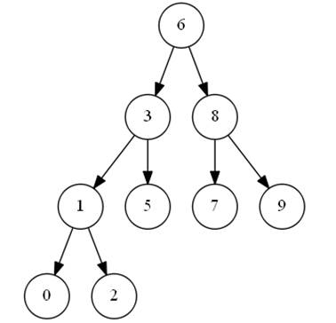

基于二叉搜索树的这种特点，在查找某个节点的时候，可以采取类似于二分查找的思想，快速找到某个节点。

**二叉搜索树的局限性**

一个二叉搜索树是由

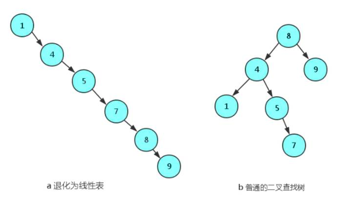

### 10.1.6 平衡二叉搜索树（AVL树）

通过二叉搜索树的分析我们发现，二叉搜索树的节点查询、构造和删除性能，与树的高度相关，如果二叉搜索树能够更“平衡”一些，避免了树结构向线性结构的倾斜，则能够显著降低时间复杂度。

平衡二叉搜索树：简称平衡二叉树。由前苏联的数学家

它具有如下几个性质：

l

l

平衡的意思，就是向天平一样保持左右水平，即两边的分量大约相同。如定义，假如一棵树的左右子树的高度之差超过

比如，依次插入

 

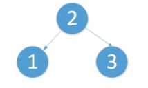

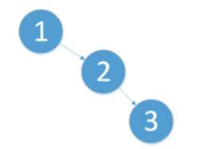

AVL


使用场景

AVL

### 10.1.7 红黑树（Red-Black Tree）

红黑树是一种特殊的二叉查找树。红黑树的每个节点上都有存储位表示节点的颜色，可以是红

性质：

l

l

l

l

l


在插入一个新节点时，默认将它涂为红色（这样可以不违背最后一条规则），然后进行旋转着色等操作，让新的树符合所有规则。

红黑树也是一种自平衡二叉查找树，可以认为是对

**使用场景**

红黑树多用于搜索

l

l

Scheduler

l

l

### 10.1.8 B树（B-Tree）

B

特点：

- l  定义任意非叶子结点最多只有M个儿子；且M>2

- l  根结点的儿子数为[2, M]

- l  除根结点以外的非叶子结点的儿子数为[M/2, M]

- l  每个结点存放至少M/2-1（取上整）和至多M-1个关键字；（至少2个key）

- l  非叶子结点的关键字个数 = 指向儿子的指针个数 – 1

- l  非叶子结点的关键字：K[1], K[2], …, K[M-1]；且K[i] < K[i+1]

- l  非叶子结点的指针：P[1], P[2], …, P[M]，其中P[1]指向关键字小于K[1]的子树，P[M]指向关键字大于K[M-1]的子树，其它P[i]指向关键字属于(K[i-1], K[i])的子树

- l  所有叶子结点位于同一层

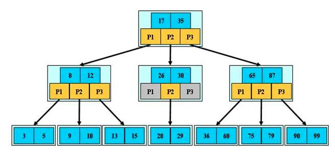

**M = 3**

### 10.1.9 B+树

B+

B+

B+

l

l

l

l

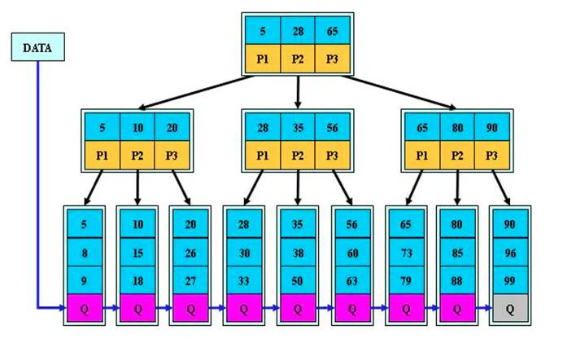

B+ 

l

l

l

## 10.2 翻转二叉树（#226）

### 10.2.1 题目说明

翻转一棵二叉树。

示例：

输入：

    4

  /   \

 2     7

 /\   / \

1   3 6  9

输出：

    4

  /   \

 7     2

 /\   / \

9   6 3  1

### 10.2.2 分析

这是一道很经典的二叉树问题。

显然，我们可以遍历这棵树，分别翻转左右子树，一层层递归调用，就可以翻转整个二叉树了。

### 10.2.3 方法一：先序遍历

容易想到，我们可以先考察根节点，把左右子树调换，然后再分别遍历左右子树、依次翻转每一部分就可以了。

这对应的遍历方式，就是先序遍历。

代码如下：

**public **

**复杂度分析**

时间复杂度：

空间复杂度：

### 10.2.4 方法二：后序遍历

类似地，我们也可以用后序遍历的思路：先递归地处理左右子树，然后再将左右子树调换就可以了。

代码如下：

**public **

复杂度分析略，与方法一完全相同。

## 10.3 平衡二叉树（#110）

### 10.3.1 题目说明

给定一个二叉树，判断它是否是高度平衡的二叉树。

本题中，一棵高度平衡二叉树定义为：

l

示例

 

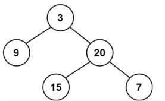

输入：

输出：

示例

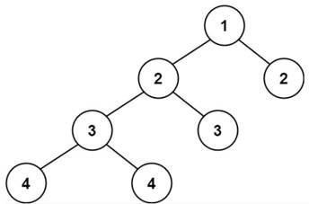

输入：

输出：

示例

输入：

输出：

### 10.3.2 分析

根据定义，当且仅当一棵二叉树的左右子树也都是平衡二叉树时，这棵二叉树是平衡二叉树。

因此可以使用递归的方式，判断二叉树是不是平衡二叉树，递归的顺序可以是自顶向下（类似先序遍历）或者自底向上（类似后序遍历）。

### 10.3.3 方法一：自顶向下

容易想到的一个方法是，从根节点开始，自顶向下递归地判断左右子树是否平衡。

具体过程是，先分别计算当前节点左右子树的高度，如果高度差不超过

代码如下：

**public class **

**复杂度分析**

时间复杂度：

最坏情况下，二叉树是满二叉树，需要遍历二叉树中的所有节点，时间复杂度是

对于节点

对于平均的情况，一棵树的高度

空间复杂度：

### 10.3.4 方法二：自底向上

上面的算法通过分析可以看到，每个节点高度的计算，会在它的祖先节点计算时重复调用，这显然是不必要的。

一种优化思路是，可以反过来，自底向上地遍历节点进行判断。计算每个节点的高度时，需要递归地处理左右子树；所以可以先判断左右子树是否平衡，计算出左右子树的高度，再判断当前节点是否平衡。这类似于后序遍历的思路。

这样，计算高度的方法

代码如下：

**public boolean **

**复杂度分析**

时间复杂度：

空间复杂度：

## 10.4 验证二叉搜索树（#98）

### 10.4.1 题目说明

给定一个二叉树，判断其是否是一个有效的二叉搜索树。

假设一个二叉搜索树具有如下特征：

l

l

l

示例

输入

    2

   /\

 1   3

输出

示例

输入

    5

   /\

 1   4

    / \

   3   6

输出

解释

    

### 10.4.2 分析

按照二叉搜索树的性质，我们可以想到需要递归地进行判断。

这里需要注意的是，如果二叉搜索树的左右子树不为空，那么左子树中的所有节点，值都应该小于根节点；同样右子树中所有节点，值都大于根节点。

### 10.4.3 方法一：先序遍历

容易想到的方法是，用先序遍历的思路，自顶向下进行遍历。对于每一个节点，先判断它的左右子节点，和当前节点值是否符合大小关系；然后再递归地判断左子树和右子树。

这里需要注意，仅有当前的节点作为参数，做递归调用是不够的。

当前节点如果是父节点的左子节点，那么以它为根的子树所有节点值必须小于父节点；如果是右子节点，则以它为根的子树所有节点值必须大于父节点。所以我们在递归时，还应该把取值范围的“上下界”信息传入。

代码如下：

**public class **

**复杂度分析**

时间复杂度

空间复杂度

### 10.4.4 方法二：中序遍历

我们知道，对于二叉搜索树，

所以我们的判断其实很简单：进行中序遍历，然后判断是否每个值都大于前一个值就可以了。

代码如下：

**public boolean **

**复杂度分析**

时间复杂度

空间复杂度

### 10.4.5 方法三：用栈实现中序遍历

我们也可以不用递归，而使用栈来实现二叉树的中序遍历。

基本思路是：首先沿着左子树一直搜索，把路径上的所有左子节点压栈；然后依次弹栈，访问的顺序就变成自底向上了。弹栈之后，先处理当前节点，再迭代处理右子节点，就实现了中序遍历的过程。

代码如下：

**public boolean **

**复杂度分析**

时间复杂度

空间复杂度