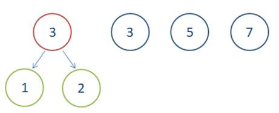

# 第十一章 贪心算法讲解

## 11.1 贪心概念和思想

贪心算法（

贪心算法设计的关键是贪心策略的选择。必须注意的是，贪心算法不是对所有问题都能得到整体最优解，选择的贪心策略必须具备无后效性。

### 11.1.1 基本思路

1.

2.

3.

4.

### 11.1.2 实现框架

从问题的某一初始解出发；

  while 

  { 

        

 }    

由所有解元素组合成问题的一个可行解；

### 11.1.3 适用场景

贪心算法存在的问题：

l

l

l

所以贪心策略适用的前提是：局部最优策略能导致产生全局最优解。

## 11.2 贪心算法的应用

经典适用的场景，有

### 11.2.1 哈夫曼树

在二叉树中，不同的深度的节点，在查询访问时耗费的时间不同。怎样让二叉树的查询效率更高呢？一个简单的想法是，如果能统计出节点被访问的频率，我们就可以让高频访问的节点深度小一点，以便更快速地访问到。

所以，我们可以给树中的每个节点赋予一个“权重”，代表该节点的访问频率；而从根节点到这个节点的访问路径，可以计算出它的长度，这就是访问一次的代价。把所有节点按照频率，求一个加权和，这就是我们平均一次访问代价的期望。

（

哈夫曼树又叫

带权路径长度即为权值与路径乘积的累加，所以哈夫曼树首先是一棵二叉树；其次，构建二叉树时通过调整节点位置，使得带权路径长度最小。

下面给出哈夫曼树中的一些基本概念定义：

l

l

l

l

l

其中

（

具体构造哈夫曼树的算法，就用到贪心策略：每次都选取当前权值最小的两个节点，让它们合并成一棵树；之后定义它们根节点的权值为左右子树之和，再让根节点和其它节点比较，最小的两个节点合并一棵树。这样，我们每一步都选取当前最优策略，最终的效果就是得到了全局最小路径权值的二叉树。这就是贪心策略的具体应用。

步骤如下：

（

用给定的

（

在森林

（

从

（

重复（

         

### 11.2.2 哈夫曼编码

哈夫曼编码（

哈夫曼编码就是哈夫曼树的实际应用。主要目的，就是根据使用频率来最大化节省字符（编码）的存储空间。

比如，我们可以定义字母表

构建哈夫曼树如下：

可以看到，我们的编码规则为：

A – 10  B – 1101  C – 1100 D – 111  E – 0

### 11.2.3 背包问题

【背包问题】有一个背包，容量是

物品：

重量：

价值：

分析：

目标函数：

约束条件：装入的物品总质量不超过背包容量：

我们自然可以想到，可以考虑贪心的策略。这里有几种选择：

（

（

（

我们的最终选择是，每次都取当前单位价值最大的物品装入背包。那么解决方案就非常简单了：选取当前剩余单位价值最大的物品放入，直到物品放完，或者背包填满。

值得注意的是，贪心算法并不是完全不可以使用，贪心策略一旦经过证明成立后，它就是一种高效的算法。

比如本题，如果题目要求物品

## 11.3 跳跃游戏（#55）

### 11.3.1 题目说明

给定一个非负整数数组，你最初位于数组的第一个位置。

数组中的每个元素代表你在该位置可以跳跃的最大长度。

判断你是否能够到达最后一个位置。

示例

输入

输出

解释

示例

输入

输出

解释

### 11.3.2 分析

这道题规定数组每个元素，就代表了可以跳跃的最大长度。

我们发现，其实只要判断出当前最远可以到达的位置，那么在这之前的元素，其实统统可以跳过。所以我们采用的，就是一个

### 11.3.3 解决方法

我们可以遍历数组中的每一个位置，并实时更新当前

对于当前遍历到的位置

在遍历的过程中，如果

代码如下：

**public class **

**复杂度分析**

时间复杂度：

空间复杂度：

## 11.4 跳跃游戏II（#45）

### 11.4.1 题目说明

给定一个非负整数数组，你最初位于数组的第一个位置。

数组中的每个元素代表你在该位置可以跳跃的最大长度。

你的目标是使用最少的跳跃次数到达数组的最后一个位置。

示例

输入

输出

解释

从下标为

说明

假设你总是可以到达数组的最后一个位置。

### 11.4.2 分析

本题跳跃规则跟上题一致，并且已经保证可以到达最后一个位置，现在是希望得到最小的跳跃步数。

要想步数最小，很容易想到的一个思路是，每一步都迈到最大，也就是直接跳到当前能达到的最远位置。这是典型的贪心策略。

但仔细分析就会发现问题：我们每次从

### 11.4.3 方法一：反向跳跃

我们可以尝试用逆向思维来思考，也就是反向跳跃。

现在我们就不是从第一个位置出发了，而是从最后一个位置出发逆推。我们首先可以得到，哪些位置，可以一步直接跳到最后。

而为了让步数最少，我们可以选择让最后一次跳跃最远，也就是说，最后一跳之前所在的位置，距离最后最远。这实际上，也是一种贪心策略。

找到最后一步跳跃前所在的位置之后，我们继续贪心地寻找倒数第二步跳跃前所在的位置，以此类推，直到找到数组的开始位置。

代码如下：

**public class **

**复杂度分析**

时间复杂度：

空间复杂度：

### 11.4.4 方法二：正向跳跃

我们可以回忆起之前的跳跃游戏中的算法，每次都贪心地找到当前位置

原因就在于，

那自然可以想到，我们也考虑长远一点，正向推导的时候考虑两步，就可以保证最优了。这还是一个贪心策略。

那这里有一个问题，第一步选了（下标）

我们可以看到，第二步，是肯定超不过的，因为我们第一步选下标

具体实现，我们可以定义双指针：一个

遍历数组，每次到达

代码如下：

*// 方法二：正向跳跃，考虑两步的最远跳跃*

**复杂度分析**

时间复杂度：

空间复杂度：

## 11.5 任务调度器（#621）

### 11.5.1 题目说明

给你一个用字符数组

然而，两个

你需要计算完成所有任务所需要的

示例

输入：

输出：

解释：

在本示例中，两个相同类型任务之间必须间隔长度为

示例

输入：

输出：

解释：在这种情况下，任何大小为

["A","A","A","B","B","B"]

["A","B","A","B","A","B"]

["B","B","B","A","A","A"]

...

诸如此类

示例

输入：

输出：

解释：一种可能的解决方案是：

  A -> B -> C -> A-> D -> E -> A -> F -> G -> A -> (

提示：

l

<= 104

l

l

### 11.5.2 分析

调度（

不同的任务可以依次执行，说明现在是单核

我们发现，由于任务是串行的，所以每个任务的执行时间不可能缩短，至少需要

### 11.5.3 方法一：模拟法

一种简单的想法是，我们按照时间顺序，依次给

如果当前有多种任务可以执行，我们可以采用贪心策略：每次选择

具体实现上，我们可以定义两个状态列表，分别保存每个任务当前剩余的个数，以及最早可执行的时间。然后可以设置一个循环，模拟时间

具体执行过程：

l

l

l

l

代码如下：

**public class **

ArrayList<Integer>(countMap.values());

ArrayList<Integer>(Collections.

**复杂度分析**

时间复杂度：

空间复杂度：

### 11.5.4 方法二：构造法

这种思路比较巧妙，我们可以构造一个二维矩阵，来可视化地表示每个任务执行的时间点。

我们首先考虑所有任务种类中，执行次数最多的那一类任务，记它为

我们使用一个宽为

而且容易看出，如果只有

(maxCount−1)

同理，如果还有其它也需要执行

如果需要执行

(maxCount −1)

处理完执行次数为

一种构造的方法是，我们从

对于任意一种任务而言，一定不会被放入同一行两次，间隔时间一定达到了

(maxCount −1)

代码如下：

*// 方法二：构造法*

**复杂度分析**

时间复杂度：

空间复杂度：