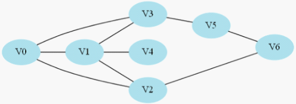
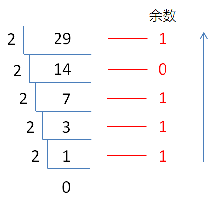

# 第十四章 深度优先搜索和广度优先搜索

## 14.1 深度优先搜索（DFS）

### 14.1.1 基本概念

深度优先搜索算法（

深度优先搜索是图论中的经典算法，利用深度优先搜索算法可以产生目标图的相应拓扑排序表，利用拓扑排序表可以方便的解决很多相关的图论问题，如最大路径问题等等。



DFS

### 14.1.2 代码实现

DFS

l

以树的先序遍历为例：

**public static void **

l

同样是树的先序遍历：

*// 先序遍历的非递归实现*

*visit*

```
}
```

### 14.1.3 复杂度分析

时间复杂度：

空间复杂度：

## 14.2 广度优先搜索（BFS）

### 14.2.1 基本概念

广度优先搜索（也称宽度优先搜索，

广度优先



这一算法也是很多重要的图的算法的原型。

### 14.2.2 代码实现

BFS

l

以树的层序遍历为例：

*// 层序遍历的递归实现*

    

    bfs(nextLevelNodes, level + 1);

}

l

同样是树的层序遍历：

**public static void **

很明显，对于层序遍历，非递归的实现代码要更加清晰简洁。

### 14.2.3 复杂度分析

时间复杂度：

空间复杂度：

## 14.3 二叉树的序列化与反序列化（#297）

### 14.3.1 题目说明

序列化是将一个数据结构或者对象转换为连续的比特位的操作，进而可以将转换后的数据存储在一个文件或者内存中，同时也可以通过网络传输到另一个计算机环境，采取相反方式重构得到原数据。

请设计一个算法来实现二叉树的序列化与反序列化。这里不限定你的序列

示例

你可以将以下二叉树：

    1

   /\

 2   3

    / \

   4   5

序列化为

提示

说明

### 14.3.2 分析

本题需要实现二叉树这种数据结构的序列化和反序列化，这类似一个编解码的过程。

序列化就是编码的过程，需要把树结构中的节点按照一定顺序遍历，然后将所有

### 14.3.3 方法一：DFS

我们可以回忆树的遍历方法。对于序列化，只要用深度优先搜索的思路，先序

而反序列化思路也是类似，只要将过程反过来。

注意，这里所有的叶子节点，左右子节点都会保存为

我们先从字符串中提取出各个节点的值，保存成列表，然后取列表头的元素作为根节点，进而递归左右子树。

代码如下：

```
**public class **TreeSerialization {    *// **方法一：**DFS**，先序遍历    *
    *// **序列化    *
    **public **String serialize(TreeNode root){*        *
        StringBuffer data = **new **StringBuffer();        
        data.append(**"["**);        
        dfs_serialize(root, data);        
        data.deleteCharAt(data.length()-1);*         *
        data.append(**"]"**);        
        **return **data.toString();    
    }    
    *// **为了方便递归调用，单独定义一个辅助序列化方法    *
    **public void **dfs_serialize(TreeNode root, StringBufferdata){        *// **基准情形        *
        **if **(root == **null**) {            
            data.append(**"null,"**);            
            **return**;        
        }*        *
        data.append(root.**val **+ **","**);        
        *// **递归处理左右子树        *
        dfs_serialize(root.**left**, data);        
        dfs_serialize(root.**right**, data);    
    }    
    *// **反序列化    *
    **public **TreeNode deserialize(String data){        
        *// **先切分成字符串数组，然后转成**LinkedList**        *
        String[] dataArr = data.split(**","**);        
        LinkedList<String> dataList= 
        **new **LinkedList<>(Arrays.*asList*(dataArr));*        *
        String firstElement = dataList.getFirst().substring(1);        
        dataList.removeFirst();        
        dataList.addFirst(firstElement);*       *
        * *String lastElement = dataList.getLast().substring(0, dataList.getLast().length() - 1);        
         dataList.removeLast();        
         dataList.addLast(lastElement);        
         **return **dfs_deserialize(dataList);    
     }    
    *// **定义一个反序列化辅助方法，方便递归调用    *
    **public **TreeNodedfs_deserialize(LinkedList<String> dataList){        
        *// **基准情形**        *
        **if **(dataList.getFirst().equals(**"null"**)){            
            dataList.removeFirst();            
            **return null**;        
         }*        *
        TreeNode node = **new **TreeNode(Integer.*valueOf*(dataList.getFirst()));        
        *// **删除当前节点，以当前节点为根继续递归        *
        dataList.removeFirst();        
        node.**left **= dfs_deserialize(dataList);    *// **后面跟着的就是左子节点        *
        node.**right **= dfs_deserialize(dataList);    *//** 后面的就是右子节点        *
        **return **node;    
    }
}
```

**复杂度分析**

时间复杂度：在序列化和反序列化中，我们只访问每个节点一次，因此时间复杂度为

空间复杂度：在序列化和反序列化中，我们递归会使用栈空间，故渐进空间复杂度为

### 14.4.4 方法二：BFS

同样，我们也可以用广度优先的思路，对应到树的遍历上，就是层序遍历。

这里需要注意的是，序列化的时候，我们需要把每一层空余的位置填满

但是，这种方法会导致额外的空间消耗。在最坏情况下，二叉树退化为单链表，节点个数就是树的深度

## 14.4 课程表（#207）

### 14.4.1 题目说明

你这个学期必须选修

在选修某些课程之前需要一些先修课程。例如，想要学习课程

给定课程总量以及它们的先决条件，请你判断是否可能完成所有课程的学习？

示例

输入

输出

解释

示例

输入

输出

解释

 

提示：

l

l

l

### 14.4.2 分析

本题描述的是一个生活中的实际问题，也是经典的“拓扑排序”问题。

对有向无环图（

       


对于

我们很容易发现，如果图中有环，就肯定没有拓扑排序了。

对于本题，我们可以把给定先修课程的“匹配”

而

### 14.4.3 方法一：广度优先搜索（BFS）

最直观的想法，我们就先找出那些不需要先修课程的课，全部学完；然后继续选那些只依赖于之前修过那些课的课程。这样划分出“阶段”，依次去学习当前阶段所能学习的所有课程，完成之后再去学习下一阶段。

这其实就是广度优先搜索（

而为了判断某课程是否已经满足了学完所有先修课的条件，可以在每次一个课程出队时，就把它的所有后续课程入度减

代码如下：

**public class **

**复杂度分析**

时间复杂度

空间复杂度

### 14.4.4 方法二：深度优先搜索（DFS）

广度优先搜索的算法是先考虑那些入度为

如果希望学完所有课程，那课程一定是有“尽头”的；换句话说，总应该有一些课程，它们是学科学习的终点，没有“后续课程”。所以我们可以优先考虑找到“没有后续课程”、也就是出度为

这就需要沿着

在深度优先搜索的过程中，为了防止环的出现，我们还应该对“当前路径”上之前搜寻的节点有一个标记；如果搜索到了之前的节点，说明有环，直接返回

代码如下：

*// 方法二：DFS*

**if **

*// 如果递归返回false，直接返回false；否则继续遍历*

**if **

**return false**

} 

**return false**

}    }    

**复杂度分析**

时间复杂度

空间复杂度

### 14.4.5 DFS的优化

为了方便快速判断节点是否已经搜索完成，我们可以另外设置一个数组

当然，我们可以发现这个

l

l

l

而且，由于结果只要求返回是否存在拓扑序列，我们其实没有必要单独用栈来保存结果

优化如下：

*// DFS优化*

**if **

**if **

**return false**

} 

**return false**

}    }    

**复杂度分析**

时间复杂度

空间复杂度