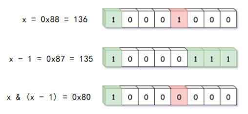

# 第十五章 位运算和数学方法讲解

## 15.1 二进制和位运算复习总结

### 15.1.1 计算机的二进制表示

计算机底层是集成数字电路，而集成电路的基础是半导体元器件。在数字电路中，每个元件只能有高电位、低电位两个稳定状态，我们把它记作1和0。

所以计算机中数据的表达，就是基于很多元件的0-1状态的组合，这是一个以2为基数的计数系统，我们把它叫做

二进制的特点，就是只用0和1两个符号进行计数，逢2进位。计算机最终处理的都是二进制的数据。

以Java中byte类型为例，一个数值占据1个字节的内存空间，具体表现就是8个二进制位。例如：

8 = (0000 1000)2    37 = (0010 0101)2    196 = (1100 0100)2

### 15.1.2 进制转换

我们的日常习惯，处理的都是十机制数，而计算机处理的是二进制数。为了更好地理解计算机底层的工作机制、优化算法性能，我们需要了解十进制和二进制之间的转换规则。

（1）二进制转十进制

二进制数转换成十进制数，方法是“按权展开求和”。

二进制数中的每一位，都对应的是2的某个整次幂。因此，我们可以直接将每一位对应的数表示为十进制，然后相加即可。

例如：

(1000 1111)2 = (27 +23 + 22 + 21+ 20)10 =(128 + 8 + 4 + 2 + 1)10 = (143)10

（2）十进制转二进制

十进制数转换成二进制数，方法是“除2取余，逆序排列”。

从二进制转十进制的过程可以看出，十进制写成2的整次幂展开的形式，就对应着二进制的每一位1，所以我们可以将原数不停除以2，得到的余数就是对应位的值。

例如：

(29)10 = (24 + 23+ 22 + 20)10 = (0001 1101)2

### 15.1.3 原码、反码和补码

对于一个数，计算机需要保存的是它的二进制形式。但是对于有符号数，又应该怎样处理呢？原码、反码、补码就是机器存储一个有符号数的具体编码方式。

（1）原码

原码就是符号位加上数值的绝对值，即用第一位表示符号，其余位表示值。比如：如果是8位二进制的正1和负1：

[+1]10 = [0000 0001]

[-1]10 = [1000 0001]

因为第一位是符号位，所以8位二进制数的取值范围就是： 

[1111 1111 ,  0111 1111]

即

[-127 , 127]

（2）反码

反码的表示方法是：

l

l

[+1] = [0000 0001]

[-1] = [1000 0001]

（3）补码

补码的表示方法是：

l

l

[+1] = [0000 0001]

[-1] = [1000 0001]

可以看得出来，不论那种编码形式，正数都是不变的；反码和补码主要用来处理负数。在计算机系统中，一般统一用补码来表示有符号数。

使用补码的好处是：

l

l

l

### 15.1.4 位运算符讲解

位运算就是直接对整数在内存中的二进制位进行操作。相比于普通的整数算术运算，位运算是底层运算，效率更高，代码也更加简洁。

Java中支持的位运算有： 

l

如果相对应位都是1，则结果为1，否则为0

l

如果相对应位都是 0，则结果为 0，否则为 1

l

按位取反运算符翻转操作数的每一位，即0变成1，1变成0

l

如果相对应位值相同，则结果为0，否则为1

l

左操作数按位左移右操作数指定的位数

l

左操作数按位右移右操作数指定的位数

l

左操作数的值按右操作数指定的位数右移，移动得到的空位以零填充

## 15.2  2的幂（#231）

### 15.2.1 题目说明

给定一个整数，编写一个函数来判断它是否是

示例

输入

输出

解释

示例

输入

输出

解释

示例

输入

输出

### 15.2.2 分析

本题是一个数学问题。在计算机系统中，

2

l

l

我们可以利用这些特性，构造出不同的解法。

### 15.2.3 方法一：除2判断余数

最简单的想法，就是借鉴十进制转换二进制的方法，不断地除以

这里需要注意的是，即使是

那如何判断当前余数

代码如下：

**public class **

**复杂度分析**

时间复杂度：

空间复杂度：

### 15.2.4 方法二：位运算（与自身减1做位与）

对于这样一个数学问题，

我们可以利用之前分析的

这种形式有一个非常明显的性质，就是减

当然很明显，位与运算的结果更好判断。写成逻辑表达式就是：

n & (n - 1) == 0

代码如下：

*// 方法二：位运算（与自身减1做位与）*

**复杂度分析**

时间复杂度：

空间复杂度：

### 15.2.5 方法三：位运算（与相反数做位与）

由于

要想其它位都变为

我们知道，在计算机底层，负数的补码表示，就是反码加

如果当前数

写成表达式就是：

n & (-n) == n

代码如下：

*// 方法三：位运算（与相反数做位与）*

**复杂度分析**

时间复杂度：

空间复杂度：

## 15.3 汉明距离（#461）

### 15.3.1 题目说明

两个整数之间的汉明距离指的是这两个数字对应二进制位不同的位置的数目。

给出两个整数

注意：

0 

示例

输入

输出

解释

1  (0  0  0  1)

4  (0  1  0  0)

       

上面的箭头指出了对应二进制位不同的位置。

### 15.3.2 分析

汉明距离（

对于两个字符串而言，汉明距离就是对应位置的不同字符的个数；对两个整数而言，汉明距离是对应位置上数字不同的位数。本题的目的，就是求出两个整数之间的汉明距离，也就是求它们二进制表示中不同的那些位的数量。

对于两个二进制数中的“某个位”，相同的不予统计，只统计那些不同的。这自然让我们联想到位运算中的“异或”：对应位相同为

所以我们要做的，就是对两个数

### 15.3.3 方法一：利用语言内置方法

大多数编程语言中，都存在各种内置计算等于

代码如下：

**public class **

**复杂度分析**

时间复杂度：

空间复杂度：

### 15.3.4 方法二：逐个移位

解决算法问题时，直接调库可能会受到面试官的质疑。所以我们最好还是自己实现一个统计位个数的方法。

最直观的想法就是，我们可以逐个右移每一位，然后判断当前最后一位是否为

判断某一位为

代码如下：

*// 方法二：逐位右移*

**复杂度分析**

时间复杂度：

空间复杂度：

### 15.3.5 方法三：快速移位（布莱恩·柯尼根算法）

上面的方法我们是逐位移动，尽管时间复杂度是

其实我们发现，对于人类来说，用肉眼直接判断会更容易：因为我们可以直接忽略那些

这种“跳过

我们可以用

这样，我们只需每次消去最右端的

这种解法叫做

代码如下：

*// 方法三：快速右移*

**复杂度分析**

时间复杂度：

空间复杂度：

## 15.4 可怜的小猪（#458）

### 15.4.1 题目说明

有

喂猪的规则如下：

1.

2.

3.

4.

5.

给你桶的数目

示例

输入：

输出：

示例

输入：

输出：

示例

输入：

输出：

 

提示：

l

l

### 15.4.2 分析

（

这道题目中主要有四个变量：小猪的数量

容易看出，两个时间变量有密切的联系。我们把一次喂小猪喝水叫做一次“实验”，由于一次实验之后必须等待冷却时间才能得到结果，所以我们最多可以进行

k = minutesToTest / minutesToDie 

次实验。

所以当前问题就是，给定

（

我们可以先把问题简化一些，考虑只有一只小猪的情形。

容易想到，小猪一次喝一个桶的水，挨个喝过去，耗费

这样的搜索方式，显然类似遍历查找，耗费

但是对于本题来说，小猪是无法一直查找下去的；如果中途遇到毒药桶，只能判断出毒药所在的大致范围。由于没有更多的小猪进一步排查，最坏情况下我们是得不到结果的。

于是可以有一个推测：需要的最少小猪数

比如考察

    

但其实并不是这样。因为我们在这个过程中，限定了每次实验只能有一只小猪去喝水，这就导致想要得到结果，必然需要

那如果我们允许多只小猪在一次实验中同时喝水，又会怎么样呢？

（

我们依然简化条件，现在考虑

最简单的考虑，当然还是每只小猪喝一个桶的水，这样只要有

进一步考虑，小猪可以同时喝多个桶的水。不同的小猪交错开，喝不同桶的水，这样它们的组合情况，就有可能涵盖了所有的桶。

比如示例二中，

这样，如果小猪

最后的组合结果分析：

1.

2.

3.

4.

（

我们把每个小猪看成一位数据，该位为

00

因为小猪是否牺牲，跟喝了哪桶水有直接关系。所以我们可以给每种情形，对应一个桶是毒药桶：

l

l

l

l

所以现在我们的问题，其实就是要用二进制编码所有的桶，最少需要的编码位数，就是我们要求的最少小猪数量。

可以想到，如果有

（

我们发现，上面的问题之所以能转换成二进制编码问题，关键就在于，每个小猪只有幸存和牺牲两种结果，于是就对应

如果现在可以进行多次（

l

l

l

l

l

l

我们类似地用

这其实就是

（

以

考虑

      

对应地，我们可以将桶①、②、③分别编码为

接下来我们继续考虑

现在有两只小猪，它们各自都有三种结局状态，所以我们可以组合出

l

l

l

l

l

l

l

l

l

这其实就是

所以我们可以用

我们进一步可以画出阶段图：

### 15.4.3 具体实现

我们总结可以发现，这其实就是一个编码问题。实验的次数

对于一个

本题中为了能测试出结果，应该有

所以对应

最小值即为

代码中为了方便计算对数，我们可以利用换底公式写作：

代码如下：

**public class **

**复杂度分析**

时间复杂度：

空间复杂度：