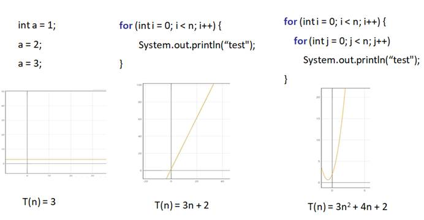
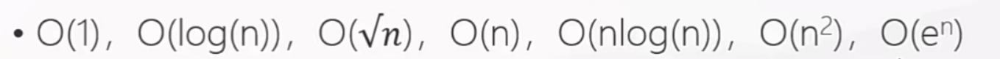
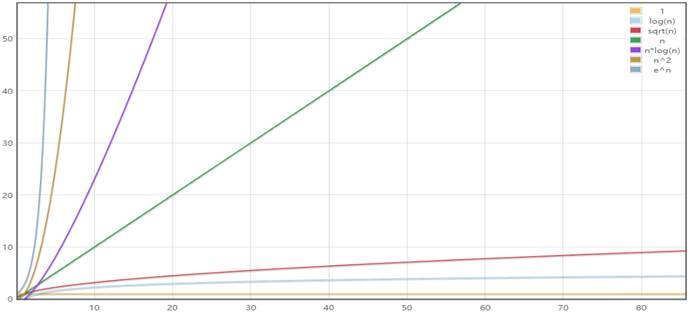
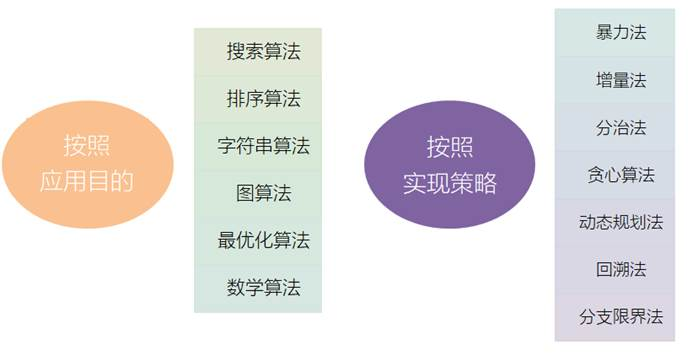

# 第一章 算法简介

作为程序员，大家对

本课程就将为大家打开算法学习的大门。首先，我们应该了解算法的基本概念。

## 1.1 算法的基本概念

### 1.1.1 什么是算法

算法（

对于计算机而言，就是一系列解决问题的清晰指令。也就是说，对于一个问题，我们可以通过算法来描述解决的策略和步骤；对于规范的输入，按照算法描述的步骤，就可以在有限时间内得到对应的输出。

### 1.1.2 为什么要学习算法

首先，算法是计算机程序的核心。在一个计算机程序中，有两个非常重要的部分：数据结构和算法。数据结构决定了程序中数据组织和存储的形式，而算法决定了程序的功能和效率。算法在具体应用时，与数据结构密不可分，是一个程序的灵魂。

其次，算法是程序员的核心竞争力。算法是解决问题的方法和步骤，所以掌握了算法，就可以拥有更强的解决问题的能力。对于一个程序员而言，这往往比学会用一个框架、一个工具更加重要。

再次，算法是

l

l

l

l

所以，算法是程序员绕不过去的必修课，也是走向架构师的必经之路。

### 1.1.3 怎样学习算法

首先，在学习算法之前，应该至少熟练掌握一门编程语言。本课程中的代码实现，都会以

其次，算法和数据结构密不可分，在系统学习算法之前，最好能够对基本的数据结构，数组、链表、哈希表、栈、队列、树都有充分的了解。在后续的课程中，我们会以算法讲解为主、穿插复习一些数据结构的基本知识。当然，算法本身是解题方法，有些也是不依赖于数据结构的，所以即使没有系统学过数据结构，同样可以开始算法的学习。

最后，算法学习的捷径，就是用算法去解决大量的具体问题，也就是通常所说的“刷题”。如果目的在于通过大厂面试，那这一步更是必不可少的准备。最经典的刷题网站，毫无疑问就是

## 1.2 算法的特征

一个算法应该具有以下五个重要的特征：

l

算法的有穷性，是指算法必须能在执行有限个步骤之后终止。

l

算法的每一步骤必须有确切的定义。

l

一个算法有

l

一个算法有一个或多个输出，以反映对输入数据加工后的结果。

l

算法中执行的任何计算步骤都是可以被分解为基本的可执行的操作步骤，即每个计算步骤都可以在有限时间内完成（也称之为有效性）。

## 1.3 算法复杂度

基于算法的有穷性，我们可以知道算法运行消耗的时间不能是无限的。而对于一个问题的处理，可能有多个不同的算法，它们消耗的时间一般是不同的；运行过程中占用的空间资源也是不同的。

这就涉及到对算法的性能考察。主要有两方面：时间和空间。在计算机算法理论中，用时间复杂度和空间复杂度来分别从这两方面衡量算法的性能。

### 1.3.1 时间复杂度（Time Complexity）

算法的时间复杂度，是指执行算法所需要的计算工作量。

一般来说，计算机算法是问题规模

问题的规模

### 1.3.2 空间复杂度

算法的空间复杂度，是指算法需要消耗的内存空间。有时候做递归调用，还需要考虑调用栈所占用的空间。

其计算和表示方法与时间复杂度类似，一般都用复杂度的渐近性来表示。同时间复杂度相比，空间复杂度的分析要简单得多。

所以，我们一般对程序复杂度的分析，重点都会放在时间复杂度上。

### 1.3.3 时间复杂度的计算

要想衡量代码的“工作量”，我们需要将每一行代码，拆解成计算机能执行一条条“基本指令”。这样代码的执行时间，就可以用“基本指令”的数量来表示了。

真实的计算机系统里，基本指令包括：

算术指令（加减乘除、取余、向上向下取整）、数据移动指令（装载、存储、赋值）、控制指令（条件或无条件跳转，子程序调用和返回）。

我们来看一些具体的代码，分析一下它们的时间复杂度：

```
1、 int a = 1；        //简单赋值操作，运行时间 1（1个单位）
2、 if (a > 1) {}      //简单判断操作、条件跳转，运行时间 1
3、 for (int i = 0; i < N; i++) {System.out.println(i);  }  //有循环，运行时间 1（i赋初值）+ N+1（判断）+N（打印）+N（i自增）= 3N + 2
```

### 1.3.4 复杂度的大O表示法

比起代码具体运行的时间，我们更关心的是，当它的输入规模增长的时候，它的执行时间我们是否还能够接受。

不同的算法，运行时间随着输入规模



在算法分析中，一般用大

l

这表示，当数据量达到一定程度时，

下图画出了常见的算法复杂度：





## 1.4 算法的分类

可以用两种不同的原则，来对算法做一个分类整理：

l

搜索算法、排序算法、字符串算法、图算法、最优化算法、数学（数论）算法

l

暴力法、增量法、分治法、贪心、动态规划、回溯、分支限界法



## 1.5 经典算法

在实际应用中，有一些经典算法和策略，都可以作为解决问题的思路：

l

l

l

l

l

l

l

接下来，我们就不同的数据结构和算法策略进行分类，用不同的算法在各章节中解决某一类问题。