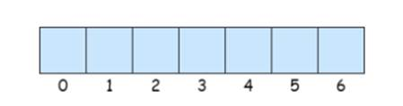

# 第二章 数组问题讲解

在程序设计中，为了处理方便，常常需要把具有相同类型的若干元素按有序的形式组织起来，这种形式就是数组（

数组是程序中最常见、也是最基本的数据结构。在很多算法问题中，都少不了数组的处理和转换。

对数组进行处理需要注意以下特点：

l



l

接下来，我们就以

## 2.1 两数之和（#1）

### 2.2.1 题目说明

给定一个整数数组

你可以假设每种输入只会对应一个答案。但是，你不能重复利用这个数组中同样的元素。

**示例**

给定

因为

所以返回

### 2.2.2 方法一：暴力法

看到一道算法题，首先考虑暴力解法，再进行优化。

暴力法其实非常简单：把所有数、两两组合在一起，计算它们的和，如果是

我们可以在代码中实现一下：

**public int**

**for**

**for**

**if**

**return new int**

}

}

**throw new **

}

**复杂度分析**

l

l

### 2.2.3 方法二：两遍哈希表

为了对运行时间复杂度进行优化，我们需要一种更有效的方法来检查数组中是否存在目标元素。如果存在，我们需要找出它的索引。这可以使用哈希表来实现。

具体实现方法，最简单就是使用两次迭代。

在第一次迭代中，我们将每个元素的值和它的索引添加到表中；然后，在第二次迭代中，我们将检查每个元素所对应的目标元素

代码如下：

**public int**

Map<Integer,Integer> map = 

*// *

**for**

map.put(nums[i], i);

}

*// *

**for**

**int **

**if**

**return new int**

}

**throw new **

**复杂度分析**

l

l

在上述算法中，我们对哈希表进行了两次扫描，这其实是不必要的。在进行迭代并将元素插入到表中的同时，我们可以直接检查表中是否已经存在当前元素所对应的目标元素。如果它存在，那我们已经找到了对应解，并立即将其返回。这样，只需要扫描一次哈希表，就可以完成算法了。

代码如下：

**public int**

Map<Integer,Integer> map = 

**for**

**int **

**if**

**return new int**

map.put(nums[i], i);

}

**throw new **

**复杂度分析**

l

l

## 2.2 三数之和（#15）

### 2.2.1 题目说明

给定一个包含

注意：答案中不可以包含重复的三元组。

**示例**

给定数组

满足要求的三元组集合为：

[

 [-1, 0, 1],

 [-1, -1, 2]

]

### 2.2.2 分析

这个问题比起两数之和来，显然要复杂了一些，而且由于结果可能有多种情况，还要考虑去重，整体难度提升了不少。

最后的返回，就不再是一个简单的数组了，而是“数组的数组”，每一组解都是一个数组，最终有多组解都要返回。

### 2.2.3 方法一：暴力法

最简单的办法，当然还是暴力法。基本思路是，每个人都先去找到另一个人，然后再一起逐个去找第三个人。

很容易想到，实现起来就是三重循环：这个时间复杂度是

代码如下：

**public **

**int **

List<List<Integer>>resultList = 

*// *

**for**

**for**

**for**

**if**

resultList.add(

Arrays.

}

}

}

}

**return **

}

运行一下，我们会发现，这个结果其实是不正确的没有去重，同样的三元组在结果中无法排除。比如

所以接下来，我们就要做一些改进，试图降低时间复杂度，而且解决去重问题。

### 2.2.4 暴力法的改进：结果去重

要做去重，自然首先想到的，就是把结果保存到一张

**public **

**int **

List<List<Integer>>result = 

Map<Integer,List<Integer>> hashMap = 

*// *

        

hashMap.get(thatNum));            tempList.add(nums[i]);            result.add(tempList);            

时间复杂度降为

但是，我们加一个输入

因为尽管通过

如果希望解决这个问题，那就需要继续加入其它的判断来做去重，整个代码复杂度会变得更高。

### 2.2.5 方法二：双指针法

暴力法搜索时间复杂度为

双指针的思路，又分为左右指针和快慢指针两种。

我们这里用的是左右指针。左右指针，其实借鉴的就是分治的思想，简单来说，就是在数组头尾各放置一个指针，先让头部的指针（左指针）右移，移不动的时候，再让尾部的指针（右指针）左移：最终两个指针相遇，那么搜索就结束了。

（

首先，我们可以想到，数字求和，其实跟每个数的大小是有关系的，如果能先将数组排序，那后面肯定会容易很多。

之前我们搜索数组，时间复杂度至少都为


下面我们通过图解，来看一下具体的操作过程。

（


固定

通过

两个基本原则：

l

nums[L] >= nums[i] > 0

l

（

L

sum = nums[i] + nums[L] + nums[R]

并按照以下规则执行双指针移动：

l


l

换下一个数，


初始同样还是

l


找到一组解

l


如果又找到

l


l


l


当

所以，最终的结果，就是

代码如下：

**public **

**int **

List<List<Integer>> result = 

*// *

复杂度分析：

l

l

尽管时间复杂度依然为

## 2.3 下一个排列（#31）

### 2.3.1 题目说明

实现获取下一个排列的函数，算法需要将给定数字序列重新排列成字典序中下一个更大的排列。

如果不存在下一个更大的排列，则将数字重新排列成最小的排列（即升序排列）。

必须原地修改，只允许使用额外常数空间。

以下是一些例子，输入位于左侧列，其相应输出位于右侧列。

1,2,3 

3,2,1 

1,1,5 

### 2.3.2 方法一：暴力法

最简单的想法就是暴力枚举，我们找出由给定数组的元素形成的列表的每个可能的排列，并找出比给定的排列更大的排列。

但是这个方法要求我们找出所有可能的排列，这需要很长时间，实施起来也很复杂。因此，这种算法不能满足要求。

**复杂度分析**

时间复杂度：

空间复杂度：

### 2.3.3 方法二：一遍扫描

首先，我们观察到对于任何给定序列的

例如，以下数组不可能有下一个排列：

[9, 5, 4, 3, 1]

这时应该直接返回升序排列。

所以对于一般的情况，如果有一个“升序子序列”，那么就一定可以找到它的下一个排列。具体来说，需要从右边找到第一对两个连续的数字

所以一个思路是，找到最后一个的“正序”排列的子序列，把它改成下一个排列就行了。


不过具体操作会发现，如果正序子序列后没数了，那么子序列的“下一个”一定就是整个序列的“下一个”，这样做没问题；但如果后面还有逆序排列的数，这样就不对了。比如

[1,3,8,7,6,2]

最后的正序子序列是

[1,6,2,3,7,8]

代码实现如下：

**public void **

**int **

*// *

*// k*

**复杂度分析**

时间复杂度：

空间复杂度：

## 2.4 旋转图像（#48）

### 2.4.1 题目说明

给定一个

将图像顺时针旋转

**说明**

你必须在原地旋转图像，这意味着你需要直接修改输入的二维矩阵。请不要使用另一个矩阵来旋转图像。

示例

给定

[

 [1,2,3],

 [4,5,6],

 [7,8,9]

],

原地旋转输入矩阵，使其变为

[

 [7,4,1],

 [8,5,2],

 [9,6,3]

]

示例

给定

[

  [5, 1, 9,11],

  [2, 4, 8,10],

 [13, 3, 6, 7],

 [15,14,12,16]

], 

原地旋转输入矩阵，使其变为

[

 [15,13, 2, 5],

 [14, 3, 4, 1],

 [12, 6, 8, 9],

 [16, 7,10,11]

]

### 2.4.2 分析

旋转图像，这个应用在图片处理的过程中，非常常见。我们知道对于计算机而言，图像，其实就是一组像素点的集合（所谓点阵），所以图像旋转的问题，本质上就是一个二维数组的旋转问题。

### 2.4.3 方法一：数学方法（转置再翻转）

我们可以利用矩阵的特性。所谓顺时针旋转，其实就是先转置矩阵，然后翻转每一行。

代码如下：

**public void **

**复杂度分析**

l

这个简单的方法已经能达到最优的时间复杂度

l

### 2.4.4 方法二：分治（分为四部分旋转）

方法

为了实现这一点，我们来研究每个元素在旋转的过程中如何移动。


这提供给我们了一个思路，可以将给定的矩阵分成四个矩形并且将原问题划归为旋转这些矩形的问题。这其实就是分治的思想。


具体解法也很直接，可以在每一个矩形中遍历元素，并且在长度为


代码如下：

**public void **

**int **

```
```

**for **

**for **

**int**

**int **

**int **

**for **

```
tmp[k] = matrix[row][col];
```

*// 定位下一个数*

**int **

```
row = col;
```

```
col = n - 1 - x;
```

```
}
```

```
```

**for **

```
matrix[row][col] = tmp[(k + 3) % 4];
```

**int **

```
row = col;
```

```
col = n - 1 - x;
```

```
}
```

```
}
```

```
}
}
```

**复杂度分析**

l

l

### 2.4.5 方法三：分治法改进（单次循环内完成旋转）

大家可能也发现了，我们其实没有必要分成

因为旋转的时候，是上下、左右分别对称的，所以我们遍历元素的时候，只要遍历一半行、一半列就可以了（

代码如下：

**public void **

**int **

```
```

*// 不区分子矩阵，直接遍历每一个元素*

**for**

**for**

**int **

```
matrix[i][j] = matrix[n-j-1][i];
```

```
matrix[n-j-1][i] = matrix[n-i-1][n-j-1];
```

```
matrix[n-i-1][n-j-1] = matrix[j][n-i-1];
```

```
matrix[j][n-i-1] = temp;
```

```
}
```

```
}
}
```

**复杂度分析**

l

l