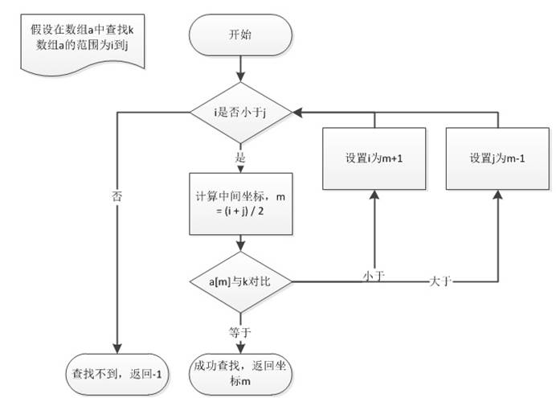

# 第三章 二分查找相关问题讲解

## 3.1 二分查找

二分查找也称折半查找（

二分查找事实上采用的就是一种分治策略，它充分利用了元素间的次序关系，可在最坏的情况下用

它的基本思想是：假设数组元素呈升序排列，将

二分查找问题也是面试中经常考到的问题，虽然它的思想很简单，但写好二分查找算法并不是一件容易的事情。

接下来，我们首先用代码实现一个对

**public class **

*        *

当然，我们也可以用递归的方式实现：

**public static int **

    

我们总结一下二分查找：

l

l

因此，二分查找方法适用于不经常变动而查找频繁的有序列表。使用条件：查找序列是顺序结构，有序。

## 3.2 搜索二维矩阵（#74）

### 3.2.1 题目说明

编写一个高效的算法来判断

l

l

示例

输入：

输出：

示例

输入：

输出：

示例

输入：

输出：

提示：

l

matrix.length

l

matrix[i].length

l

<= 100

l

matrix[i][j], target <= 104

### 3.2.2 分析

既然这是一个查找元素的问题，并且数组已经排好序，我们自然可以想到用二分查找是一个高效的查找方式。

输入的

行列坐标为

row = idx / n;  col = idx % n;

### 3.2.3 实现：二分查找

代码实现如下：

**public class **

*// *

**复杂度分析**

l

l

## 3.3 寻找重复数（#287）

### 3.3.1 题目说明

给定一个包含

**示例**

输入

输出

**示例**

输入

输出

**说明**

l

l

l

l

### 3.3.2 分析

怎样证明

这里，

### 3.3.3 方法一：保存元素法（存入HashMap）

首先我们想到，最简单的办法就是，遍历整个数组，挨个统计每个数字出现的次数。

用一个

代码如下：

**public int **

### 3.3.4 方法二：保存元素法改进（存入Set）

当然我们应该还能想到，其实没必要用

**public int **

**复杂度分析**

时间复杂度：

空间复杂度：

尽管时间复杂度较小，但以上两种保存元素的方法，都用到了额外的存储空间，这个空间复杂度不能让我们满意。

### 3.3.5 方法三：二分查找

这道题目中数组其实是很特殊的，我们可以从原始的

l

l

例如：

1

本来最简单（重复数出现两次，其它

1

现在没有

我们可以发现一个规律：

l

l

用数学化的语言描述就是：

我们把对于

则：当

所以要找

代码实现如下：

**public int **

**复杂度分析**

l

l

### 3.3.6 方法四：排序法

另一个想法是，我们可以先在原数组上排序。

排序之后，所有重复的数会排在一起；这样，只要我们遍历的时候发现连续两个元素相等，就可以输出结果了。

代码如下：

**public int **

**复杂度分析**

l

l

### 3.3.7 方法五：快慢指针法（循环检测）

这是一种比较特殊的思路。把

那么如果

比如数组

[3

保存为：

整体思路如下：

l

a)

b)

c)

l

d)

e)

第二次相遇时，应该有：

慢指针总路程

快指针总路程

并且，快指针总路程是慢指针的

环内

把环内项移到同一边，就有：

**环内相遇点到入口**

这就很清楚了：从环外

代码如下：

**public int **

**复杂度分析**

l

l

通过快慢指针循环检测这样的巧妙方法，实现了在不额外使用内存空间的前提下，满足线性时间复杂度