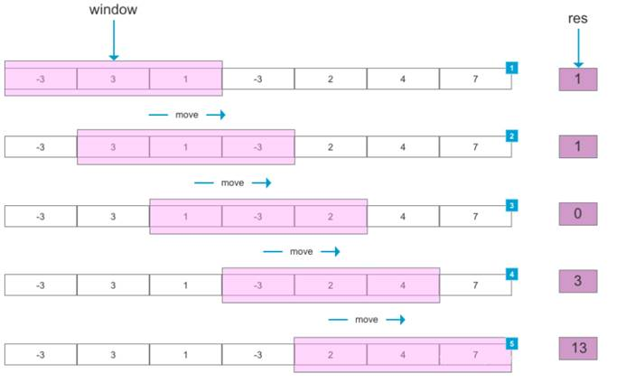
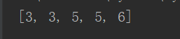
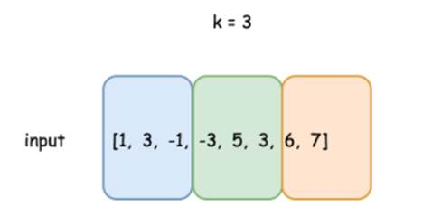
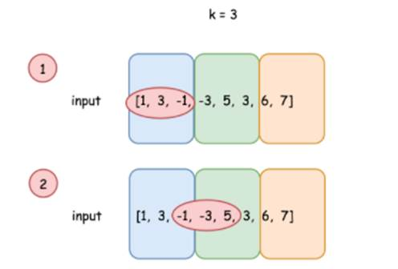
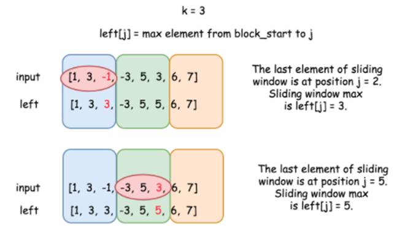
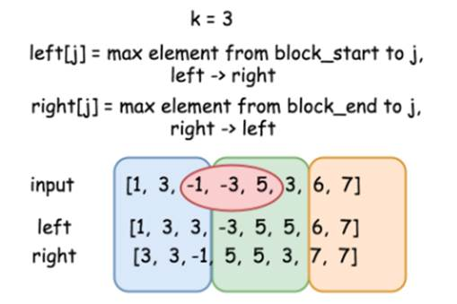
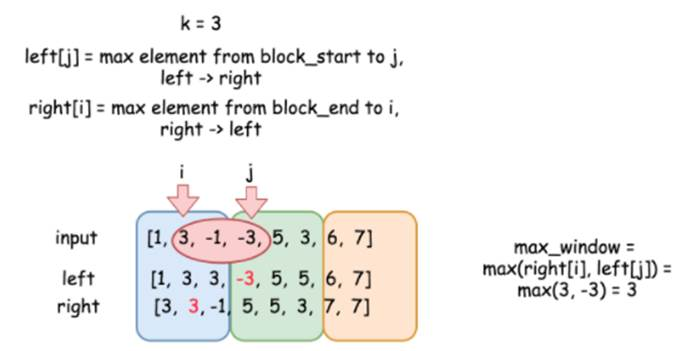
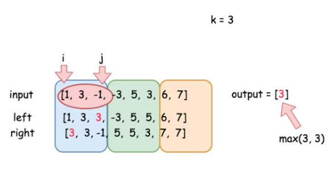

# 第五章 滑动窗口相关问题讲解

滑动窗口算法是在给定特定窗口大小的数组或字符串上执行要求的操作，它的原理与网络传输

这种技术可以将一部分问题中的嵌套循环转变为一个单循环，因此它可以减少时间复杂度。

例如，设定滑动窗口（



因为滑动窗口是靠窗口起始、结束两个位置来表示的，所以滑动窗口也可以看作特殊的“双指针”。

## 5.1 滑动窗口最大值（#239）

### 5.1.1 题目说明

给定一个数组

返回滑动窗口中的最大值。

进阶：你能在线性时间复杂度内解决此题吗？

- 示例1:

```
输入: nums =[1,3,-1,-3,5,3,6,7], 和 k = 3
输出: [3,3,5,5,6,7] 
```

- 解释: 

```
  滑动窗口的位置              最大值
---------------               -----
[1 3  -1] -3  5 3  6  7        3
 1[3  -1 -3] 5  3  6  7        3
 1  3[-1  -3 5] 3  6  7        5
 1 3  -1 [-3  5  3]6  7        5
 1 3  -1  -3 [5 3  6] 7        6
 1 3  -1  -3  5[3  6 7]        7
```

- 示例 2：

```
输入：nums = [1], k =1
输出：[1]
```

- 示例 3：

```
输入：nums = [1,-1], k= 1
输出：[1,-1]
```

- 示例 4：

```
输入：nums = [9,11], k= 2
输出：[11]
```

- 示例 5：

```
输入：nums = [4,-2], k= 2
输出：[4]
```

- 提示：

```
 1 <= nums.length <= 10^5
  -10^4 <= nums[i] <= 10^4
  1 <= k <= nums.length
```

### 5.1.2 分析

       这是一个典型的滑动窗口的问题。由于滑动窗口的大小

   所以我们可以直接推出窗口的个数为

### 5.1.3 方法一：暴力法

最简单直接的方法，就是遍历每个滑动窗口，找到每个窗口的最大值。

- **Python代如下：**

```
def get_max(var):
    max=var[0]
    for item in var:
        if item>max:
            max=item
    return max
    
if __name__ == '__main__':
    var=[1,3,-1,-3,5,3,6,7]
    k=3
    res=[]
    #1、或者滑动窗口内的内容
    for start in range(len(var)-k):
        end=start+k
        #2、get_max() return max   获取最大值
        max=get_max(var[start:end])
        res.append(max)
    print(res)
```



- **JAVA代码如下：**

```
**public class **SlidingWindowMaximum {    
    **public int**[] maxSlidingWindow(**int**[] nums, **int **k) {*        *
        **int**[] result = **new int**[nums.**length **- k + 1];        
        *// **遍历数组        *
        **for**(**int **i = 0; i <= nums.**length **- k; i++){*            *
            **int **max = nums[i];*            *
            **for**(**int **j = i; j < i + k; j++){                
                **if**( nums[j] > max ){                    
                    max = nums[j];                
                }            
            }            
            result[i] = max;        
        }        
        **return **result;    
    }
}
```


- **复杂度分析**

- 时间复杂度： O(Nk)，双重循环，外层遍历数组循环N次，内层遍历窗口循环k次，所以整体就是O(N) * O(k) = O(Nk)，表现较差。在leetcode上提交，会发现超出了题目要求的运行时间限制。

- 空间复杂度：O(N-k)，输出数组用到了N-k+1的空间。

### 5.1.4 方法二：使用堆

如何优化时间复杂度呢？可以使用堆。

构建一个大顶堆（

在代码中，我们可以用一个优先队列（

- **JAVA代码如下:**

```
**public int**[] maxSlidingWindow(**int**[] nums, **int **k) {*    *
    **int**[] result = **new int**[nums.**length **- k + 1];    
    *// **用优先队列定义一个大顶堆    *
    PriorityQueue<Integer> maxHeap = **new **PriorityQueue<>(k, **new **Comparator<Integer>() {        
        **@Override        **
        **public int **compare(Integer o1, Integer o2) {            
            **return **o2 - o1;*         *
        }    
    });*    *
    **for **(**int **i = 0; i < k; i++) {        
        maxHeap.add(nums[i]);    
    }    
    result[0] = maxHeap.peek();*    *
    *// **遍历数组    *
    **for**(**int **i = 1; i <= nums.**length **- k; i++){       
          maxHeap.remove(nums[i - 1]);*        *
         * *maxHeap.add(nums[i + k - 1]);*         *
          result[i] = maxHeap.peek();*    *
    }    
      **return **result;
  }
```

- **复杂度分析**

- 时间复杂度： O(Nlog(k))，在大小为 k 的堆中插入一个元素只需要消耗 log(k) 时间，因此这样改进后，算法的时间复杂度为O(Nlog(k))。但提交依然会超出时间限制。

- 空间复杂度：O(N)，输出数组用到了O(N-k+1)的空间，大顶堆用了O(k)。

### 5.1.5 方法三：使用双向队列

使用堆看起来不错，但离题目要求还有差距。能否得到

我们发现，窗口在滑动过程中，其实数据发生的变化很小：只有第一个元素被删除、后面又新增一个元素，中间的大量元素是不变的。也就是说，前后两个窗口中，有大量数据是

[1, 3, -1,] -3, 5, 3, 6, 7

1, [3, -1, -3,] 5, 3, 6, 7

1, 3, [-1, -3, 5,] 3, 6, 7

自然想到，其实可以使用一个

这种场景，可以使用

在构建双向队列的时候，可以采用删除队尾更小元素的策略，所以，得到的其实就是一个

这样存储的元素，可以认为是遵循“更新更大”原则的。

- **JAVA具体代码如下：**

```
**public int**[] maxSlidingWindow(**int**[] nums, **int **k) {*    *
    **if **(k == 1) **return **nums;*    *
    **int**[] result = **new int**[nums.**length **- k + 1];*    *
    ArrayDeque<Integer> deque = **new **ArrayDeque<>();    
    *// **初始化双向队列    ***for **(**int **i = 0; i < k; i++){*        *
    **while **(!deque.isEmpty() && nums[i] >nums[deque.getLast()]){            
        deque.removeLast();        
    }*        *
    deque.addLast(i);    
    }    
    result[0] = nums[deque.getFirst()];*    *
    *// **遍历数组    *
    **for**(**int **i = k; i < nums.**length**; i++){*        *
        **if **(!deque.isEmpty() &&deque.getFirst() == i - k){            
            deque.removeFirst();        
        }*        *
        **while **(!deque.isEmpty() && nums[i] > nums[deque.getLast()]){            
            deque.removeLast();        
        }        
        deque.addLast(i);*         *
        result[i - k + 1] =nums[deque.getFirst()];*    *
    }    
    **return **result;
}
```

- **复杂度分析**

- 时间复杂度：O(N)，每个元素被处理两次：其索引被添加到双向队列中，以及被双向队列删除。

- 空间复杂度： O(N)，输出数组使用了 O(N−k+1) 空间，双向队列使用了O(k)。

### 5.1.6 方法四：左右扫描

上面的算法，时间复杂度已经可以满足要求了，空间复杂度也不高；但是用到了双向队列这样的高级数据结构，具体算法也有些繁琐。

这里再介绍另一种巧妙的算法：

算法的主要思想，是将输入数组分割成有

分块的时候，如果



开头元素为



情况



为了处理更复杂的情况



两数组合在一起，就可以提供相邻两个块内元素的全部信息。

现在我们考虑从下标



同样，如果是第一种情形，都在一个块内，用上面的公式也是正确的（这时



这个算法时间复杂度同样是

代码如下：

**public int**

**复杂度分析**

时间复杂度：

空间复杂度：

## 5.2 最小覆盖子串（#76）

### 5.2.1 题目说明

给你一个字符串

注意：如果

示例

输入：

输出：

示例

输入：

输出：

提示：

l

l

进阶：你能设计一个在

### 5.2.2 分析

所谓“子串”，指的是字符串中连续的一部分字符集合。这就要求我们考察的所有字符，应该在同一个“窗口”内，这样的问题非常适合用滑动窗口的思路来解决。

而所谓的“最小子串”，当然就是符合要求的、长度最小的子串了。

另外还有一个小细节：需要找出“包含

### 5.2.3 方法一：暴力法

最简单直接的方法，就是直接枚举出当前字符串所有的子串，然后一一进行比对，选出覆盖

这里的核心问题是，怎样判断一个子串中包含了

如果

所以我们发现，只要统计出


子串

代码如下：

**public class **

**复杂度分析**

时间复杂度：

空间复杂度：

### 5.2.4 方法二：滑动窗口

暴力法的缺点是显而易见的：时间复杂度过大，超出了运行时间限制。在哪些方面可以优化呢？

仔细观察可以发现，我们在暴力求解的时候，做了很多无用的比对：对于字符串“

代码实现上，我们可以定义两个指针：指向子串“起始点”的左指针，和指向子串“结束点”的右指针。它们一个固定、另一个移动，彼此交替向右移动，就好像开了一个大小可变的窗口、在不停向右滑动一样，所以这就是非常经典的滑动窗口解决问题的应用场景。所以有时候，滑动窗口也可以归类到双指针法。

代码如下：

**public **

**复杂度分析**

时间复杂度：

空间复杂度：

### 5.2.5 方法三：滑动窗口优化

这里考虑进一步优化：

我们计算子串

其实，每次都只是左指针或右指针做了一次右移，只涉及到

具体应该分左指针右移和右指针右移两种情况讨论。

l

l

代码如下：

**public **

**复杂度分析**

时间复杂度：

哈希表的大小与字符集的大小有关，设字符集大小为

这种解法实现了线性时间运行。

空间复杂度：

### 5.2.6 方法四：滑动窗口进一步优化

我们判断

我们已经知道，每次指针的移动，只涉及到

代码如下：

**public **

**复杂度分析**

时间复杂度：

空间复杂度：

## 5.3 找到字符串中所有字母异位词（#438）

### 5.3.1 题目说明

给定一个字符串

字符串只包含小写英文字母，并且字符串

说明：

l

l

示例

输入

s: "cbaebabacd" p:"abc"

输出

[0, 6]

解释

起始索引等于

起始索引等于

 

输入

s: "abab" p: "ab"

输出

[0, 1, 2]

解释

起始索引等于

起始索引等于

起始索引等于

### 5.3.2 分析

“字母异位词”，指“字母相同，但排列不同的字符串”。注意这里所说的“排列不同”，是所有字母异位词彼此之间而言的，并不是说要和目标字符串

另外，我们同样应该考虑，

### 5.3.3 方法一：暴力法

最简单的想法，自然还是暴力法。就是直接遍历

考虑到子串和

代码如下：

**public class **

**复杂度分析**

时间复杂度：

空间复杂度：

### 5.3.4 方法二：滑动窗口（双指针）

暴力法的缺点是显而易见的：时间复杂度较大，运行耗时较长。

我们在暴力求解的时候，其实对于很多字母是做了多次统计的。子串可以看作字符串上开窗截取的结果，自然想到，可以定义左右指针向右移动，实现滑动窗口的作用。在指针移动的过程中，字符只会被遍历一次，时间复杂度就可以大大降低。

代码如下：

**public **

**复杂度分析**

时间复杂度：

空间复杂度：