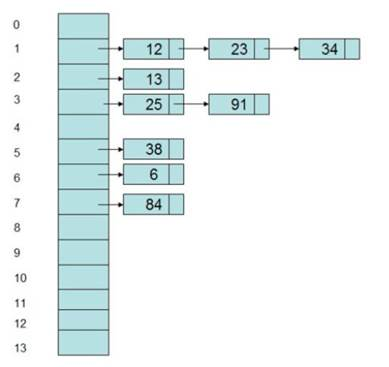

# 第七章 哈希表相关问题讲解

## 7.1 哈希表数据结构复习

### 7.1.1 基本概念

哈希表（

哈希表里保存的数据元素是一组键

哈希表在不考虑冲突的情况下，插入、删除和访问操作时间复杂度均为

### 7.1.2 核心问题

设计一个哈希表，有两个核心问题需要去解决：

1)

2)

哈希方法（

一个好的哈希方法，应该将不同的键值，均匀地分布在存储空间中。理想情况下，每个值都应该有一个对应唯一的散列值。

哈希方法要将大量的键值，映射到一个有限的空间里。这样就有可能会将不同的键值，映射到同一个存储空间，这种情况称为

为了解决

## 7.2 只出现一次的数字（#136）

### 7.2.1 题目说明

给定一个非空整数数组，除了某个元素只出现一次以外，其余每个元素均出现两次。找出那个只出现了一次的元素。

说明：

你的算法应该具有线性时间复杂度。你可以不使用额外空间来实现吗？

示例

输入

输出

示例

输入

输出

### 7.2.2 分析

这是基于数组的一道题目。

题目中除了一个元素之外，其它都出现两次。所以我们可以想到，只要把元素是否出现过记录下来，遍历完数组就可以判断出单独的那个数了。

### 7.2.3 方法一：暴力法

基本想法是，遍历数组，把当前所有出现的单独元素都另外保存下来。遇到重复的就删除。

代码如下：

**public int **

**复杂度分析**

时间复杂度：

空间复杂度：

### 7.2.4 方法二：保存到HashMap

由于在列表中查询需要耗费线性时间，所以可以想到，可以把数不保存到列表，而是保存到

代码如下：

**public int **

**复杂度分析**

时间复杂度：

空间复杂度：

### 7.2.5 方法三：保存到set

我们可以也利用

代码如下：

**public int **

时间复杂度：

空间复杂度：

### 7.2.6 方法四：位运算

我们回忆一下数学上异或运算的概念：

l

a

l

a

l

a

所以我们只需要将所有的数进行

代码如下：

**public int **

**复杂度分析**

时间复杂度：

空间复杂度：

## 7.3 最长连续序列（#128）

### 7.3.1 题目说明

给定一个未排序的整数数组

进阶：你可以设计并实现时间复杂度为

示例

输入：

输出：

解释：最长数字连续序列是

示例

输入：

输出：

提示：

l

l

### 7.3.2 分析

要寻找连续序列，关键在于找到当前数的“下一个数”（或者叫“后继”）。

如果有后继，就在数组中继续找，每找到一个后继，当前序列长度就加

### 7.3.3 方法一：暴力法

最简单的实现，就是遍历所有数据，对每一数据都找从它开始的最长连续序列。

寻找连续序列，就是要不停寻找后继。而判断后继是否存在，又要在数组中进行遍历寻找。

代码实现如下：

**public class **

**复杂度分析**

时间复杂度：

空间复杂度：

### 7.3.4 方法二：哈希表改进

用哈希表（

代码实现如下：

**public int **

**复杂度分析**

时间复杂度：

空间复杂度：

### 7.3.5 方法三：哈希表进一步优化

仔细分析上面的算法过程，我们会发现其中执行了很多不必要的枚举。

例如，我们已经寻找过

并且，我们可以确定，这种情况得到的结果（连续序列的长度），肯定不会优于以

代码如下：

**public int **

**复杂度分析**

时间复杂度：

空间复杂度：

## 7.4. LRU缓存机制（#146）

### 7.4.1 题目说明

运用你所掌握的数据结构，设计和实现一个

实现

l

capacity) 

l

key) 

l

key, int value) 

进阶：你是否可以在

示例：

输入

["LRUCache", "put","put", "get", "put", "get","put", "get", "get", "get"]

[[2], [1, 1], [2, 2], [1], [3, 3], [2], [4,4], [1], [3], [4]]

输出

[null, null, null, 1, null, -1, null, -1,3, 4]

解释

LRUCache lRUCache = new LRUCache(2);

lRUCache.put(1, 1); // 

lRUCache.put(2, 2); // 

lRUCache.get(1);    // 

lRUCache.put(3, 3); // 

lRUCache.get(2);    // 

lRUCache.put(4, 4); // 

lRUCache.get(1);    // 

lRUCache.get(3);    // 

lRUCache.get(4);    // 

提示：

l

capacity <= 3000

l

<= 3000

l

<= 104

l

### 7.4.2 分析

LRU

所谓的“最近最久未使用”，就是根据数据的历史访问记录来判断的，其核心思想是“如果数据最近被访问过，那么将来被访问的几率也更高”。

LRU

具体实现上，既然保存的是键值对，而且要根据

需要额外考虑的是，缓存空间有限，所以这个

这就要求我们必须把数据，按照一定的线性结构排列起来，最新访问的数据放在后面，新数据的插入可以“顶掉”最前面的不常访问的数据。这种数据结构其实可以用

所以，我们最终可以使用一个哈希表

### 7.4.3 方法一：使用LinkedHashMap

在

代码如下：

**public class **

### 7.4.4 方法二：自定义哈希表+双向链表

上面的实现虽然简单，但是有取巧的嫌疑，如果在真正的面试中给出这样的代码，很可能面试官是无法满意的。我们需要做的，还是自己实现一个简单的双向链表，而不是直接套用语言自带的封装数据结构。

代码如下：

**public class **

**复杂度分析**

时间复杂度：

空间复杂度：