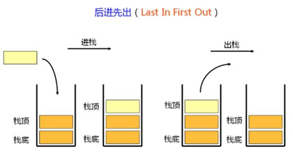

# 第八章 栈和队列相关问题讲解

## 8.1 栈和队列数据结构复习

### 8.1.1 栈（Stack）

栈（

栈被限定仅在表尾进行插入或删除操作。表尾称为栈顶，相应地，表头称为栈底。所以栈具有“后进先出”（

栈的基本操作除了在栈顶进行插入（入栈，



### 8.1.2 队列

队列（

在具体应用中通常用链表或者数组来实现。队列只允许在后端（称为

队列的操作方式和堆栈类似，唯一的区别在于队列只允许新数据在后端进行添加。


l

双端队列，是限定插入和删除操作在表的两端进行的线性表。

队列的每一端都能够插入数据项和移除数据项。

相对于普通队列，双端队列的入队和出队操作在两端都可进行。所以，双端队列同时具有队列和栈的性质。


l

优先队列不再遵循先入先出的原则，而是分为两种情况：

**最大优先队列，无论入队顺序，当前最大的元素优先出队。**

**最小优先队列，无论入队顺序，当前最小的元素优先出队。**

比如有一个最大优先队列，它的最大元素是


要满足以上需求，利用线性数据结构并非不能实现，但是时间复杂度较高，需要遍历所有元素，最坏时间复杂度

因此，一般是用

**入队操作：**

1.


2.


**出队操作：**

1.


2.


3.


二叉堆节点上浮和下沉，操作次数不会超过数的深度，所以时间复杂度都是

## 8.2 使用队列实现栈（#225）

### 8.2.1 题目说明

使用队列实现栈的下列操作：

l

l

l

l

注意

l

l

l

### 8.2.2 分析

这道题目涉及到栈和队列两种数据结构。它们的共同特点是，数据元素以线性序列的方式存储；区别在于，元素进出的方式不同。

队列本身对数据元素的保存，是完全符合数据到来次序的，同时也保持这个顺序依次出队。而弹栈操作的实现，是要删除最后进入的数据，相当于反序弹出。

实现的基本思路是，我们可以用一个队列保存当前所有的数据，以它作为栈的物理基础；而为了保证后进先出，我们在数据入队之后，就把它直接移动到队首。

### 8.2.3 方法一：两个队列实现

可以增加一个队列来做辅助。我们记原始负责存储数据的队列为

l

queue1

queue2

l

queue1

queue2

l

queue1

queue2

而对于弹栈操作，只要直接让

代码如下：

**public class **

**复杂度分析**

时间复杂度：入栈操作

push

pop

top

isEmpty

空间复杂度：

### 8.2.4 方法二：一个队列实现

当一个新的元素

代码如下：

**public class **

*    *

*    *

        

```
    }
```

*    *

*        *

*        *

*        *

            

*        *

```
    }
```

*    *

*        *

    }

*    *

        

    }

*    *

        

```
    }
```

```
}
```

**复杂度分析**

时间复杂度：入栈操作

push

pop

top

isEmpty

空间复杂度：

## 8.3 使用栈实现队列（#232）

### 8.3.1 题目说明

请你仅使用两个栈实现先入先出队列。队列应当支持一般队列的支持的所有操作（

实现

l

l

l

l

说明：

l

l

 

进阶：

你能否实现每个操作均摊时间复杂度为

 

示例：

输入：

["MyQueue", "push","push", "peek", "pop", "empty"]

[[], [1], [2], [], [], []]

输出：

[null, null, null, 1, 1, false]

解释：

MyQueue myQueue = new MyQueue();

myQueue.push(1); // queue is: [1]

myQueue.push(2); // queue is: [1, 2](leftmost is front of the queue)

myQueue.peek(); // return 1

myQueue.pop(); // return 1, queue is [2]

myQueue.empty(); // return false 

提示：

l

l

l

### 8.3.2 分析

我们要用栈来实现队列。

想要反转，简单的想法是只要把所有元素依次弹出，并压入另一个栈，自然就变成本来栈底元素到了栈顶了。所以我们的实现，需要用到两个栈。

### 8.3.3 方法一：入队时反转

一种直观的思路是，最终的栈里，按照“自顶向下”的顺序保持队列。也就是说，栈顶元素是最先入队的元素，而最新入队的元素要压入栈底。

我们可以

最简单的实现，就是直接用


代码如下：

**public class **

**复杂度分析**

l

时间复杂度：

除新元素之外，所有元素都会被压入两次，弹出两次。新元素被压入两次，弹出一次。（当然，我们可以稍作改进，在

这个过程产生了

空间复杂度：

需要额外的内存来存储队列中的元素。

l

时间复杂度：

空间复杂度：

### 8.3.4 方法二：出队时反转

可以不要在入队时反转，而是在出队时再做处理。


执行出队操作时，我们想要弹出的是


我们观察可以发现，

代码实现如下：

**public class **

**复杂度分析**

l

时间复杂度：

空间复杂度：

l

时间复杂度：

在最坏情况下，

但当

空间复杂度

l

时间复杂度：

空间复杂度：

### 8.3.5 摊还复杂度分析

摊还分析（

对于一连串操作而言，可能某种情况下某个操作的代价特别高，但总体上来看，也并非那么糟糕，可以形象的理解为把高代价的操作“分摊”到其他操作上去了，要求的就是均摊后的平均代价。

摊还分析的核心在于，最坏情况下的操作一旦发生了一次，那么在未来很长一段时间都不会再次发生，这样就会均摊每次操作的代价。

摊还分析与平均复杂度分析的区别在于，平均情况分析是平均所有的输入。而摊还分析是平均操作。在摊还分析中，不涉及概率，并且保证在最坏情况下每一个操作的平均性能。

所以摊还分析，往往会用在某一数据结构的操作分析上。

## 8.4 有效的括号（#20）

### 8.4.1 题目说明

给定一个只包括

有效字符串需满足：

1.

2.

注意空字符串可被认为是有效字符串。

示例

输入

输出

示例

输入

输出

示例

输入

输出

示例

输入

输出

示例

输入

输出

### 8.4.2 分析

判断括号的有效性，这是一个非常经典的问题。

由于给定字符串中只包含

对于合法的输入字符，关键在于

由于规则是：

### 8.4.3 具体实现

代码实现非常简单：我们可以创建一个栈，然后遍历字符串。遇到左括号，就压栈；遇到右括号，就判断和当前栈顶的左括号是否匹配，匹配就弹栈，不匹配直接返回

代码如下：

**public class **

**复杂度分析**

时间复杂度：

空间复杂度：

## 8.5 柱状图中最大的矩形（#84）

### 8.5.1 题目说明

给定

求在该柱状图中，能够勾勒出来的矩形的最大面积。


以上是柱状图的示例，其中每个柱子的宽度为

 


图中阴影部分为所能勾勒出的最大矩形面积，其面积为

示例

输入

输出

### 8.5.2 分析

题目要求计算最大矩形面积，我们可以发现，关键其实就在于确定矩形的“宽”和“高”（即矩形面积计算中的长和宽）。

而宽和高两者间又有制约条件：一定宽度范围内的高，就是最矮那个柱子的高度。

### 8.5.3 方法一：暴力法

一个简单的思路，就是遍历所有可能的宽度。也就是说，以每个柱子都作为矩形的左右边界进行计算，取出所有面接中最大的那个。

代码如下：

**public class **

**复杂度分析**

时间复杂度：

空间复杂度：

### 8.5.4 方法二：双指针

我们可以首先遍历数组，以当前柱子的高度，作为考察的矩阵“可行高度”。然后定义左右两个指针，以当前柱子为中心向两侧探寻，找到当前高度的左右边界。

左右边界的判断标准，就是出现了比当前高度矮的柱子，或者到达了数组边界。

代码实现如下：

**public int **

*    *

*    *

*        *

*        *

*        // 寻找左边界*

**while **

**if **

*    *

```
}
```

*// 寻找右边界*

**while **

    

*    *

}

**int **

**int **

```
largestArea = currArea > largestArea ? currArea : largestArea;
```

```
}
```

**return **

```
}
```

**复杂度分析**

时间复杂度：

空间复杂度：

### 8.5.5 方法三：双指针优化

在双指针法寻找左右边界的过程中我们发现，如果当前柱子比前一个柱子高，那么它的左边界就是前一个柱子；如果比前一个柱子矮，那么可以跳过之前确定更高的那些柱子，直接从前一个柱子的左边界开始遍历。

这就需要我们记录下每一个柱子对应的左边界，这可以单独用一个数组来保存。

代码如下：

**public int **

**复杂度分析**

时间复杂度：

空间复杂度：

### 8.5.6 方法四：使用单调栈

从上面的算法中我们可以发现，“找左边界”最重要的，其实就是排除左侧不可能的那些元素，跳过它们不再遍历。

所以我们可以考虑用这样一个数据结构，来保存当前的所有“候选左边界”。

当遍历到一个高度时，就让它和“候选列表”中的高度比较：如果发现它比之前的候选大，可以直接追加在后面；而如果比之前的候选小，就应该删除之前更大的候选。最终，保持一个按照顺序、单调递增的候选序列。

过程中应该按照顺序，先比对最新的候选、再比对较老的候选。

栈中存放的元素具有单调性，这就是经典的数据结构

我们用一个具体的例子

我们需要求出每一根柱子的左侧且最近的小于其高度的柱子。初始时的栈为空。

（

栈：

（

栈：

（

栈：

（

栈：

（

栈：

（

栈：

这样一来，我们得到它们左侧的柱子编号分别为

用相同的方法，我们从右向左进行遍历，也可以得到它们右侧的柱子编号分别为

在得到了左右两侧的柱子之后，我们就可以计算出每根柱子对应的左右边界，并求出答案了。

代码如下：

**public int **

**复杂度分析**

时间复杂度：

空间复杂度：

### 8.5.7 方法五：单调栈优化

当一个柱子高度比栈顶元素小时，我们会弹出栈顶元素，这就说明当前柱子就是栈顶元素对应柱子的右边界。所以我们可以只遍历一次，就求出答案。

代码如下：

**public int **

**for **

**int **

**复杂度分析**

时间复杂度：

空间复杂度：