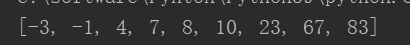

# 第九章 排序相关问题讲解

## 9.1 排序算法复习

常见的排序算法可以分为两大类：比较类排序，和非比较类排序。

l

l

算法复杂度总览


### 9.1.1 选择排序（SelectionSort）

选择排序是一种简单直观的排序算法。

它的工作原理：首先在未排序序列中找到最小（大）元素，存放到排序序列的起始位置，然后，再从剩余未排序元素中继续寻找最小（大）元素，然后追加到已排序序列的末尾。以此类推，直到所有元素均排序完毕。

- **python代码实例：**

```python
def get_max(var,index):
    num=-1000000
    max_index=None
    for i in range(len(var)+index):
        if var[i]>num:
            num=var[i]
            max_index=i
    return max_index
if __name__ == '__main__':
    var=[23,10,8,-1,-3,6,4,7]
    for i in range(len(var)-1):
        last_index=0-i
        max_index=get_max(var,last_index)
        var[max_index],var[last_index-1]=var[last_index-1],var[max_index]
    print(var)
```


### 9.1.2 冒泡排序（Bubble Sort）

冒泡排序也是一种简单的排序算法。

它的基本原理是：重复地扫描要排序的数列，一次比较两个元素，如果它们的大小顺序错误，就把它们交换过来。这样，一次扫描结束，我们可以确保最大（小）的值被移动到序列末尾。

这个算法的名字由来，就是因为越小的元素会经由交换，慢慢

- **python代码实例：**

```
if __name__ == '__main__':
    var=[23,10,8,-1,-3,6,4,7]
    count=1
    for j in range(len(var)-2):
        count=1
        for i in range(len(var)-count):
            if var[i]>var[i+1]:
                var[i],var[i+1]=var[i+1],var[i]
    print(var)
```


### 9.1.3 插入排序（Insertion Sort）

插入排序的算法，同样描述了一种简单直观的排序。

它的工作原理是：构建一个有序序列。对于未排序数据，在已排序序列中从后向前扫描，找到相应位置并插入。

以上三种简单排序算法，因为需要双重循环，所以时间复杂度均为

**python代码实例:**

```
if __name__ == '__main__':
    var=[23,10,8,-1,-3,6,4,7]
    new=[]
    new.append(var[0])
    del var[0]
    for item in var:
        for i in range(len(new)):
            if new[i]>item:
                new.insert(i,item)
                break
            elif i+1>=len(new):
                new.append(item)
    print(new)
```


### 9.1.4 希尔排序（Shell Sort）

1959

它与插入排序的不同之处在于，它会优先比较距离较远的元素。希尔排序又叫

希尔排序在数组中采用

希尔排序中对于增量序列的选择十分重要，直接影响到希尔排序的性能。一些经过优化的增量序列如

**python代码示例：**

```
if __name__ == '__main__':
    var=[23,10,8,-1,-3,6,4,7]
    length=len(var)//2
    while length!=0:
        for i in range(len(var)-length):
            if var[i]>=var[i+length]:
                var[i],var[i+length]=var[i+length],var[i]
        length=length//2
    print(var)
```


### 9.1.5 归并排序（Merge Sort）

归并排序是建立在归并操作上的一种有效的排序算法。该算法是采用分治法（

将已有序的子序列合并，得到完全有序的序列；即先使每个子序列有序，再使子序列段间有序。若将两个有序表合并成一个有序表，称为

归并排序的时间复杂度是

**python代码示例：**

```
def merge(left,right):                #用于合并
    if len(right)>len(left):
        left,right=right,left
    for item in left:
        for i in range(len(right)):
            if item<right[i]:
                right.insert(i,item)
                break
            elif i+1>=len(right):
                right.append(item)
    return right
def fun(left,right):                #用于拆分
    if len(left)==1:
        res=merge(left,right)
        return res
    second=len(left)//2
    left=fun(left[:second],left[second:])
    right=fun(right[:second],right[second:])
    res=merge(left,right)
    return  res
if __name__ == '__main__':
    var=[23,10,8,-1,-3,67,83,4,7,]
    second=len(var)//2
    left=var[:second]
    right=var[second:]
    res=fun(left,right)
    print(res)
```



### 9.1.6 快速排序（Quick Sort）

快速排序的基本思想：通过一趟排序，将待排记录分隔成独立的两部分，其中一部分记录的关键字均比另一部分的关键字小，则可分别对这两部分记录继续进行排序，以达到整个序列有序。

可以看出，快排也应用了分治思想，一般会用递归来实现。

快速排序使用分治法来把一个串（

l

l

l

这里需要注意，分区操作在具体实现时，可以设置在序列首尾设置

**JAVA代码示例：**

```java
**public class **QuickSort {*   *
    * ***public static void **qSort( **int**[] nums, **int **start, **int **end ){*        *
     **if **( start >= end ){          
         **return**;*        *
         **int **mid = *partition*(nums, start, end);*        *
         *qSort*( nums, start, mid - 1 );        
         *qSort*( nums, mid + 1, end );    
     }    
     *// **定义一个分区方法    *
     **private static int **partition( **int**[] nums, **int **start, **int **end ){*        *
   *     *    nums[right] = nums[left];*        *
      }*        *
      nums[left] = pivot;       
      **return **left;    
      }
  }
```

快速排序的时间复杂度可以做到

### 9.1.7 堆排序（Heap Sort）

堆排序是指利用堆这种数据结构所设计的一种排序算法。

堆（

一般情况，将堆顶元素为最大值的叫做“大顶堆”（

算法简单来说，就是构建一个大顶堆，取堆顶元素作为当前最大值，然后删掉堆顶元素、将最后一个元素换到堆顶位置，进而不断调整大顶堆、继续寻找下一个最大值。

这个过程有一些类似于选择排序（每次都选取当前最大的元素），而由于用到了二叉树结构进行大顶堆的调整，时间复杂度可以降为

### 9.1.8 计数排序（Counting Sort）

计数排序不是基于比较的排序算法，其核心在于将输入的数据值转化为键存储在额外开辟的数组空间中。作为一种线性时间复杂度的排序，计数排序要求输入的数据必须是有确定范围的整数。

简单来说，就是要找到待排序数组中的最大和最小值，得到所有元素可能的取值范围；然后统计每个值出现的次数。统计完成后，只要按照取值顺序、依次反向填充目标数组就可以了。

计数排序时间复杂度是

### 9.1.9 桶排序（Bucket Sort）

桶排序是计数排序的升级版。它利用了函数的映射关系，高效与否的关键就在于映射函数的确定。

桶排序


桶排序最好情况下使用线性时间

桶排序的时间复杂度，取决与对各个桶之间数据进行排序的时间复杂度，因为其它部分的时间复杂度都为

### 9.1.10 基数排序（Radix Sort）

基数排序可以说是桶排序的扩展。

算法原理是按照低位先排序，然后收集；再按照高位排序，然后再收集；依次类推，直到最高位。

最常见的做法，就是取


第一次排序：按照个位的值，将每个数保存到对应的桶中：


将桶中的数据依次读出，填充到目标数组中，这时可以保证后面的数据，个位一定比前面的数据大。


第二次排序：按照十位的值，将每个数保存到对应的桶中：


因为每个桶中的数据，都是按照个位从小到大排序的，所以再次顺次读出每个桶中的数据，就得到了完全排序的数组：


基数排序的空间复杂度为

## 9.2 数组中的第K个最大元素（#215）

### 9.2.1 题目说明

在未排序的数组中找到第

示例

输入

输出

示例

输入

输出

说明

l

### 9.2.2 分析

要寻找数组中第

**public class **

我们知道，

如果实际遇到这个问题，直接调类库方法去排序，显然是不能让面试官满意的。我们应该手动写出排序的算法。

选择、冒泡和插入排序时间复杂度是

对于这道题目而言，其实还可以进一步优化：因为我们只关心第

基于这样的想法，显然归并这样的算法就无从优化了；但快排和堆排序可以。

### 9.2.3 方法一：基于快速排序的选择

我们可以改进快速排序算法来解决这个问题：在分区（

另外，我们知道快速排序的性能和“划分”出的子数组的长度密切相关。我们可以引入随机化来加速这个过程，它的时间代价的期望是

代码如下：

**public int **

**复杂度分析**

时间复杂度：

空间复杂度：

### 9.2.4 方法二：基于堆排序的选择

我们也可以使用堆排序来解决这个问题。

基本思路是：构建一个大顶堆，做

在很多语言中，都有优先队列或者堆的的容器可以直接使用，但是在面试中，面试官更倾向于让更面试者自己实现一个堆。所以这里我们要手动做一个类似堆排序的实现。

代码如下：

**public int **

**复杂度分析**

时间复杂度：

空间复杂度：

## 9.3 颜色分类（#75）

### 9.3.1 题目说明

给定一个包含红色、白色和蓝色，一共

此题中，我们使用整数

进阶：

l

l

示例

输入：

输出：

示例

输入：

输出：

示例

输入：

输出：

示例

输入：

输出：

 

提示：

l

l

l

### 9.3.2 分析

本题是经典的“荷兰国旗问题”，由计算机科学家

荷兰国旗是由红白蓝


假设这样的条纹有多条，且各种颜色的数量不一，并且随机组成了一个新的图形，新的图形可能如下图所示，但是绝非只有这一种情况：


需求是：把这些条纹按照颜色排好，红色的在上半部分，白色的在中间部分，蓝色的在下半部分，我们把这类问题称作荷兰国旗问题。

本题其实就是荷兰国旗问题的数学描述，它在本质上，其实就是就是一个有重复元素的排序问题。所以可以用排序算法来解决。

当然，最简单的方式，就是直接调

**public void **

时间复杂度为

### 9.3.3 方法一：基于选择排序

如果用选择排序的思路，我们可以通过遍历数组，找到当前最小（或最大的数）。

对于本题，因为只有

事实上，最后对于

代码如下：

**public void **

**复杂度分析**

时间复杂度：

空间复杂度：

### 9.3.4 方法二：基于计数排序

根据题目中的提示，要排序的数组中，其实只有

所以另一种思路是，我们可以直接统计出数组中

代码如下：

**public class **

**复杂度分析**

时间复杂度：

空间复杂度：

### 9.3.5 方法三：基于快速排序

前面的算法，尽管时间复杂度为

一个思路是，使用双指针。所有的

代码如下：

**public void **

**复杂度分析**

时间复杂度：

空间复杂度：

## 9.4 合并区间（#56）

### 9.4.1 题目说明

给出一个区间的集合，请合并所有重叠的区间。

示例

输入

输出

解释

示例

输入

输出

解释

提示：

l

<= intervals[i][1]

### 9.4.2 分析

要判断两个区间

### 9.4.3 解决方法：排序

一个简单的想法是，我们可以遍历每一个子区间，然后判断它跟其它区间是否可以合并。如果某两个区间可以合并，那么就把它们合并之后，再跟其它区间去做判断。

很明显，这样的暴力算法，时间复杂度不会低于

这里我们发现，判断区间是否可以合并的关键，在于它们左边界的大小关系。所以我们可以先把所有区间，按照

那么在排完序的列表中，可以合并的区间一定是连续的。如下图所示，标记为蓝色、黄色和绿色的区间分别可以合并成一个大区间，它们在排完序的列表中是连续的：


具体代码如下：

**public class **

**复杂度分析**

时间复杂度：

空间复杂度：