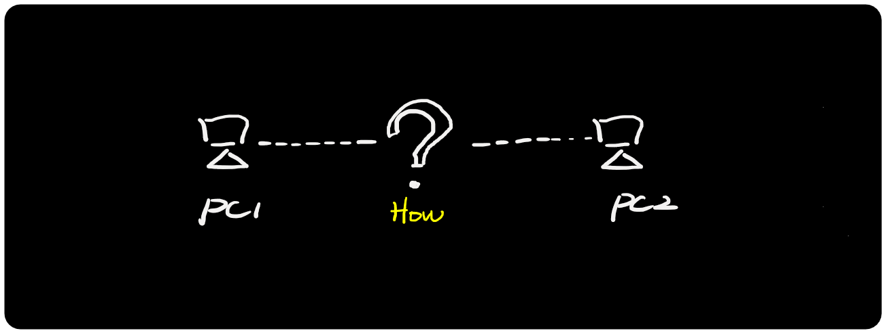
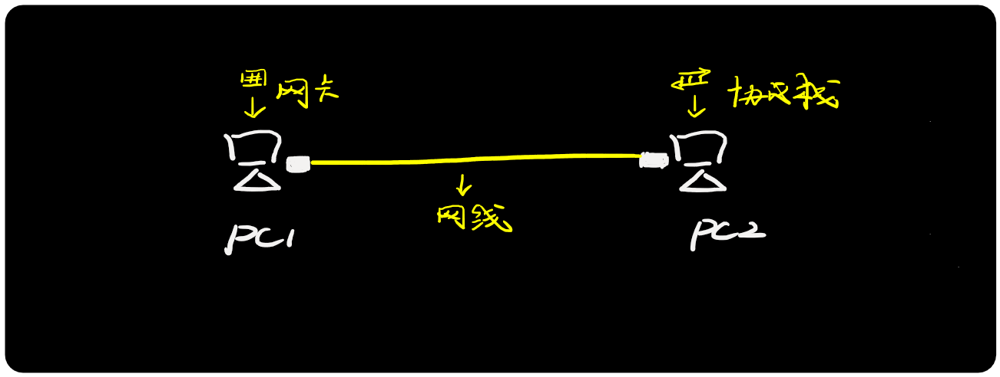
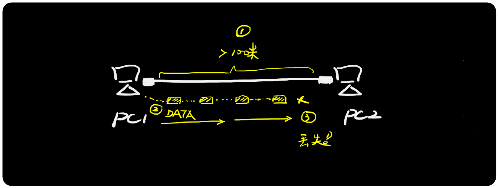
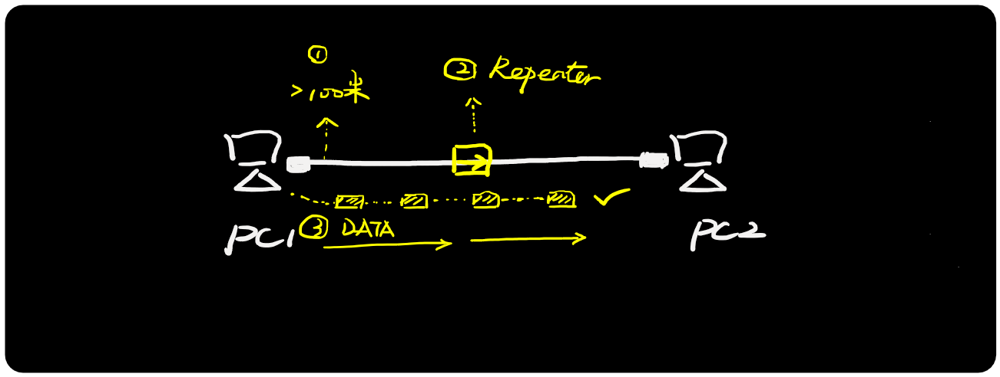
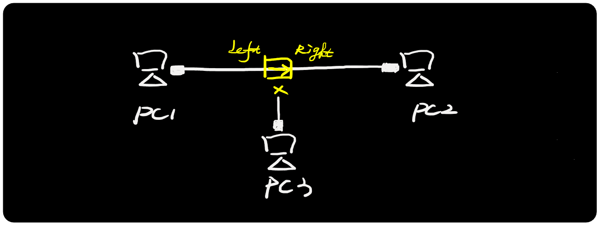
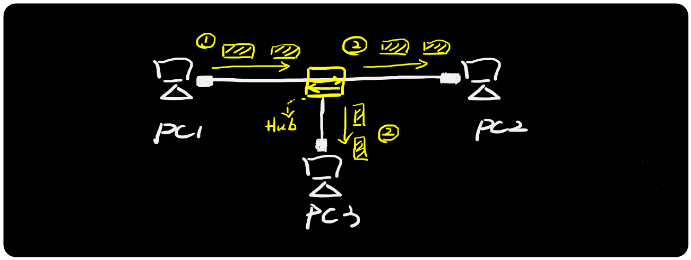
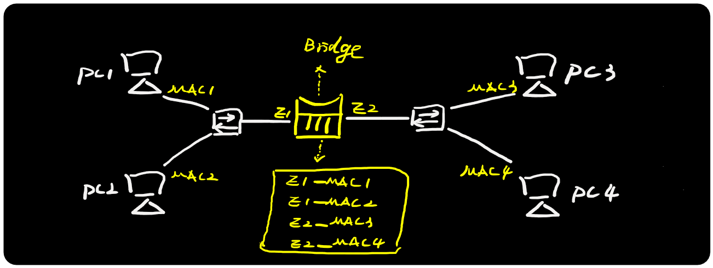
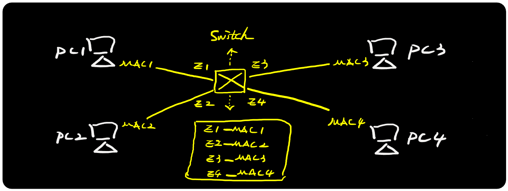

**2.1 互联网发展史**

**章节目标：**

- 了解互联网的发展过程

- 了解联网设备的功能

- 能用网络图标绘制网络拓扑

 

 

**如何将两个主机连接起来？**

**「图解」**

  在网络诞生之前，电脑之间都是单机运行，没有网卡、没有网线、没有协议栈，数据传输主要通过软盘、光盘等介质。

 

 

**网线来了**

**「图解」**

 ①「网线+网卡+协议栈」三要素，是组成“最小单元网络”的基础，缺一不可。

 ②网线提供

 ③网卡进行

 ④协议栈作为

 

 

**网线不够长肿么办？**

**「图解」**

  终端之间如果距离太远，一旦超过网线物理传输距离上限，则数据开始丢失。

 

 

**中继器来了**

**「图解」**

**  **

 

 

**中继器口不够肿么办？**

**「图解」**

  中继器一般只有

 

 

**集线器来了**

**「图解」**

  ①集线器（Hub）是一种 “

   ②集线器不识别数据包的寻址信息和上层内容，无法对终端主机进行隔离，多个主机处于同一个

网络，带宽利用率较低。

 

 

**怕骚扰肿么办？网桥来了**

**「图解」**

  ①网桥（Bridge）是一种链路层产品，能够记录终端主机的MAC地址并生成MAC表（也称为CAM表），MAC表相当于“地图”，网桥根据MAC表转发主机之间的数据流。

  ②网桥能够进行冲突域隔离，有效的提高网络带宽利用率，不同接口之间的数据不会相互冲突。例如PC1发给PC2的数据不会给转发到右边（E2口）。

  ③网桥的接口比较有限，默认是两个接口，对网络的冲突隔离比较有限，网桥没有专用的硬件而是采用CPU来处理数据，相对速度不够快。

 

 

 

 

**不够快肿么办？交换机来了**

**「图解」**

  ①交换机（Switch）是一种链路层产品，能够记录终端主机的MAC地址并生成MAC表（也称为CAM表），MAC表相当于“地图”，交换机根据MAC表转发主机之间的数据流。

  ②交换机是在网桥的基础上进行延伸和升级，相比网桥，主要有几个优势：

-  接口数量更加密集（每个主机在独立的冲突域，带宽利用率大大提高）

-  采用专用ASIC硬件芯片进行高速转发

-  能够进行VLAN隔离（不仅仅可以隔离冲突域，而且通过VLAN隔离广播域）

  ③交换机是一种局域网产品（历史上有很多局域网技术，目前是以太网技术称霸），一般用于本地网络，无法实现远程广域网通信。

 