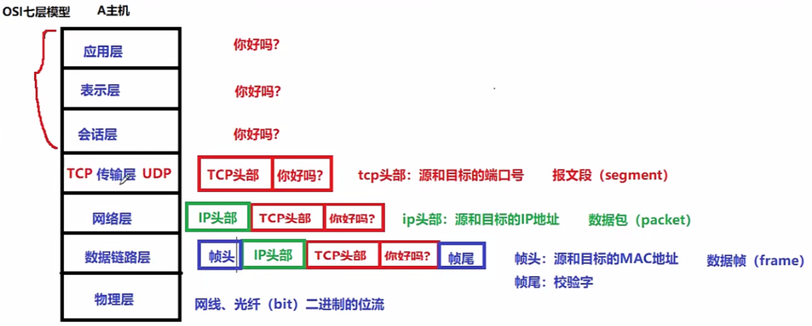
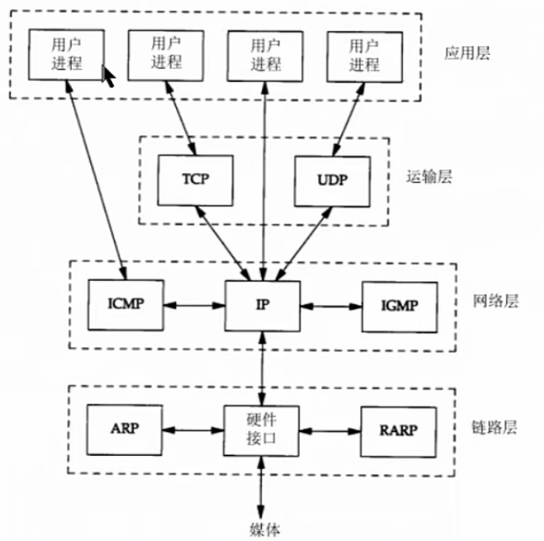

# 1.什么是TCP/IP:模型

- ·TCP/IP协议模型(Transmission Control Protocol/Internet Protocol),包含了一系列构成互联网基础的网络协议，是Internet的核心协议，通过20多年的发展已日渐成熟，并被广泛应用于局域网和广域网中，目前已成为一种国际标准。

- TCP小P协议簇是一组不同层次上的多个协议的组合，该协议采用了4层的层级结构，每一层都呼叫它的下一层所提供的协议来完成自己的需求，与OS的七层模型相对应。

- 尽管通常称该协议族为代PIP,但TCP和IP只是其中的两种协议而已（该协议族的另一个名字是Internett协议族(Internet Protocol Suite)

# 2.TCP/IP的分层结构

# 链路层

**OSI的物理层和数据链路层**

- **ARP**(地址解析协议**IP->MAC**)和**RARP**(逆地址解析协议**MAC->P**)是某些网络接口（如以太网）使用的特殊协议，用来转换P层和网络接口层使用的地址。

# 网络层

**OSI 网络层**

- 也称作互联网层或网际层，处理分组在网络中的活动，例如分组的选路。

- 在TCP/IP协议族中，网络层协议包括IP协议（网际协议），ICMP协议(Internet?互联网控制报文协议)，以及IGMP协议(Internet组管理协议)。

- **IP**是一种网络层协议，提供的是一种不可靠的服务，它只是尽可能快地把分组从源结点送到目的结点，但是并不提供任何可靠性保证。同时被TCP和UDP使用。

- **TCP**和**UDP**的每组数据都通过端系统和每个中间路由器中的1P层在互联网中进行传输。

- **ICMP**是IP协议的附属协议。IP层用它来与其他主机或路由器交换错误报文和其他重要信息。它主要是用来提供有关通向目的地址的路径信息。Ping和Traceroute.工具，它们都使用了ICMP协议。

- **IGMP**是Internet组管理协议。它用来把一个UDP数据报多播到多个主机。该协议运行在主机和组播路由器之间。

# 运输层

**OSI传输层**

主要为两怠主机上的应用程序提供端到端的通信。在TCP小P协议族中，有两个互不相同的传输协议：

TCP(传输控制协议)和UDP(用户数据报协议)

- **TCP协议：**为两台主机提供高可靠性的数据通信。TCP是面向连接的通信协议，通过三次握手建立连接，通讯完成时要断开连接，由于TCP是面向连接的所以只能用于端到端的通讯。TCP提供的是一种可靠的数据流服务，采用“带重传的肯定确认"技术来实现传输的可靠性。也就是TCP数据包中包括序号(seq)和确认(ack)，所以未按照顺序收到的包可以被排序，而损坏的包可以被重传。

- **UDP协议**：则为应用层提供一种非常简单的服务。它是面向无连接的通讯协议，UDP数据包括目的端口号和源端口号信息，由于通讯不需要连接，所以可以实现广播发送。

UDP通讯时不需要接收方确认，不保证该数据报能到达另一端，属于不可靠的传输，可能会出现丢包现象。

UDP与TCP位于同一层，但它不管数据包的顺序，错误或重发。

# 应用层

**OSI会话层、表示层、应用层**

**应用层负责处理特定的应用程序细节。**

# 数据封装过程

- 数据格式

- **TCP数据信息**：TCP头部+实际数据(TCP头包括源和目标主机**端口号**、顺序号、确认号、校验字等)

- **IP数据包：**IP头部+TCP数据信息(IP头包括源和目标主机**IP地址**、类型、生存期等)

- **数据帧**：帧头+IP数据包+帧尾（帧头包括源和目标主机**MAC初步地址**及类型，帧尾是校验字）

- 数据的封装与解封装：

- **封装：**数据要通过网络进行传输，要从高层一层一层的向下传送，如果一个主机要传送数据到别的主机，先把数据装到一个特殊协议报头中，这个过程叫一封装。

- **解封装：**上述的逆向过程

当数据以TCP/IP协议传输时的封装与街封装过程如下图：