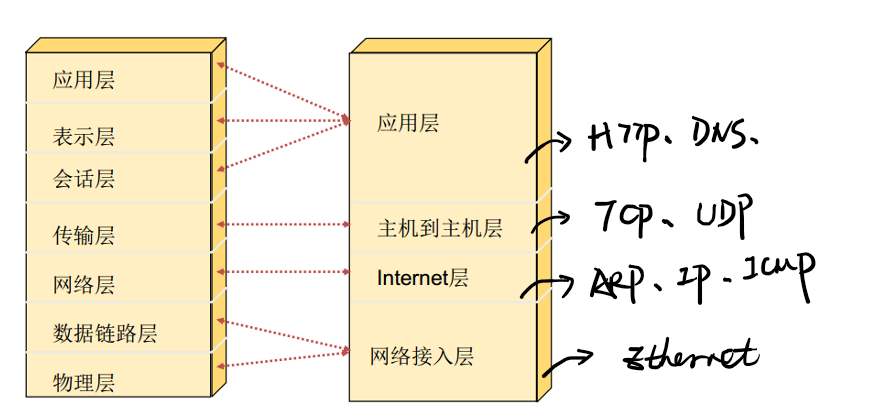
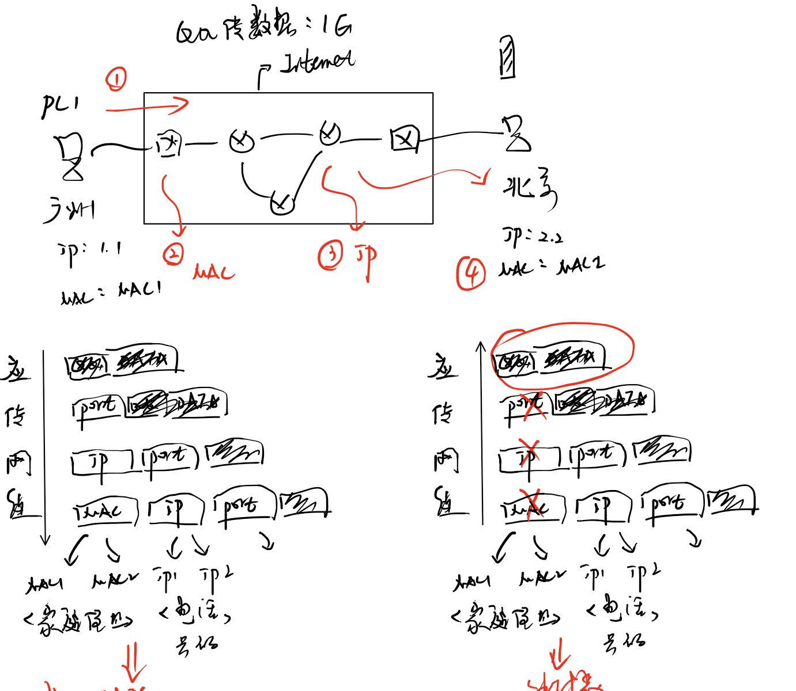
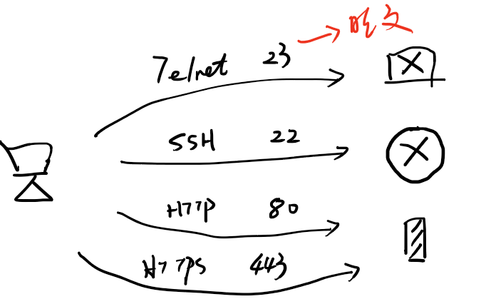
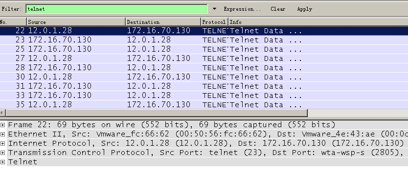

# 1、TCP/IP 协议栈

## 1.1 概述

①1960年代，美国国防部组建的军事网络-阿帕网(APRANET),而TCP/P协议栈则是运行在阿帕网上的通信协议族：

②需要接入阿帕网联网的设备，都需要安装TCPP协议栈（可以看出一个软件或者驱动）；

③同时代的通信协议栈还有很多，例如BM公司开发的SNA网络体系结构，DEC公司开发的DNA网络体系结构；不同公司和政府之间网络不同兼容；

④1983年，国际标准化委员会(1S0)发布了OS标准（开发系统互联模型），采用七层模型来统一不同的网络标准；

⑤随着网络的发展，以美国军方为代表的TCPP通信机制凭借前期优势最终在市场上战胜其他

企业标准；现在的电脑都是安装TCP小P协议栈进行通信。

**2、TCP/IP协议栈**

OSI模型是一个理论框架，而TCP/IP协议栈是一个事实标准。

**应用层**

作用：为用户提供软件/接口

 

软件：

即时通讯=> 微信、QQ、陌陌、脉脉、钉钉

购物软件=>天猫、京东、美丽说、唯品会

影音类=>暴风影音、风行、PPS、爱奇艺

 

协议：HTTP、HTTPS、BT/P2P、OICQ、

**传输层**

作用：用于实现数据的可靠或不可靠传输。

协议：TCP、UDP

**网络层**

作用：提供IP地址和三层通信（路由器）功能。

协议：IP协议

**链路层/接入层**

作用：提供MAC地址和二层通信（交换机）功能。

协议：Ethernet

**3、数据封装与解封装（发送接收过程）**

①数据封装是一个为数据包加入寻址信息的过程（类似快递）

②

③IP地址用于唯一标志通信设备，面向路由器

④MAC地址用于唯一标志局域网设备，面向交换机

|   |   |   |   | 
| -- | -- | -- | -- |
|   | 课堂实验：【Wireshark学习TCP/IP协议栈】 |   |   | 
|   |   | 【如何查看电脑ip地址】 | 
|   |   |   | 

通过telnet进行协议过滤，学习wireshark的抓包界面

**【抓包软件】**

wireshark：协议分析、流量分析、安全分析

科来网络分析系统：国产wireshark

Sniffer

Omnipeek

tcpdump：Linux/Unix下抓包软件

**【虚拟机网卡模式】**

虚拟机 -> 虚拟网卡 -> 网卡模式（NAT模式-桥接模式-主机模式）

**注：一般默认选择NAT模式**