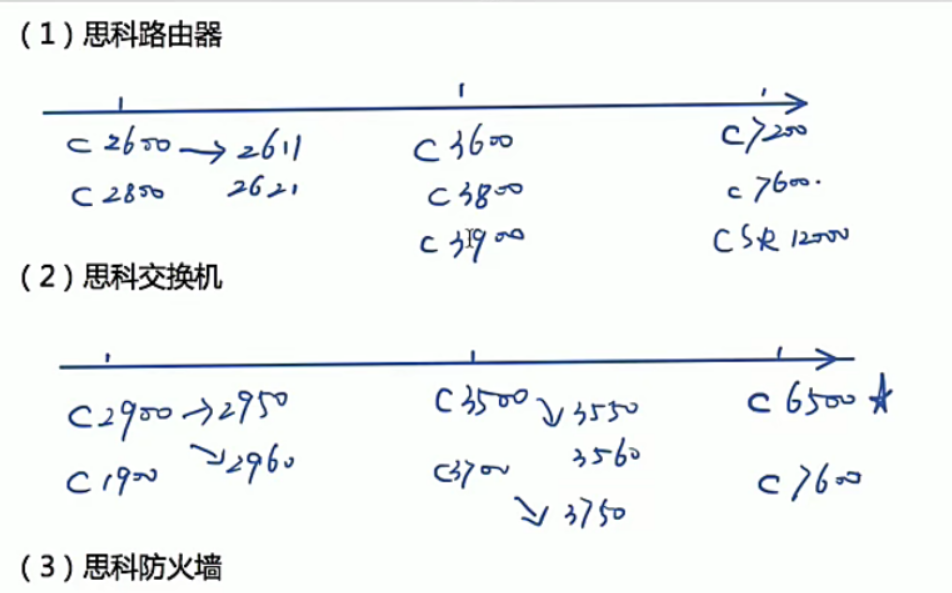
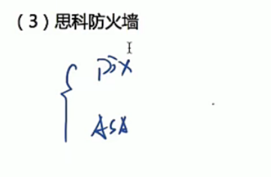
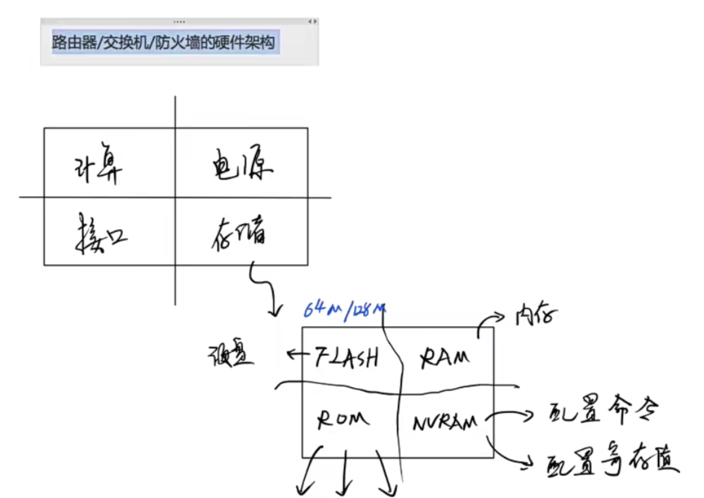
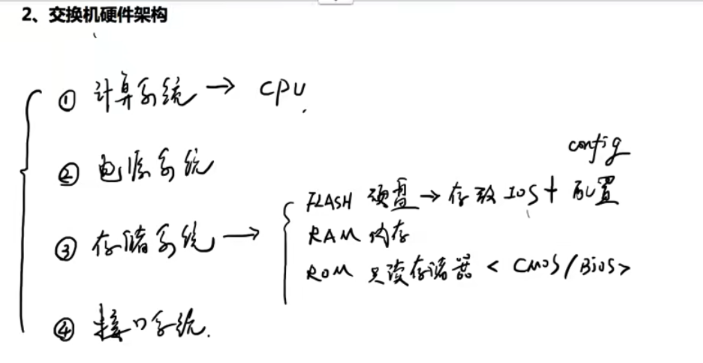
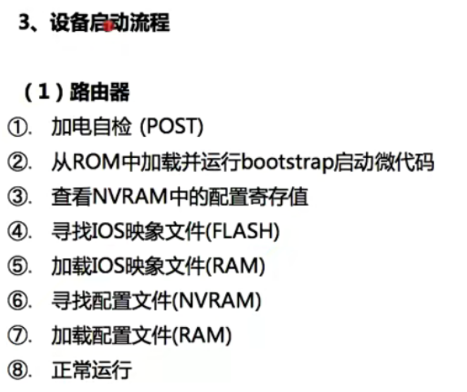
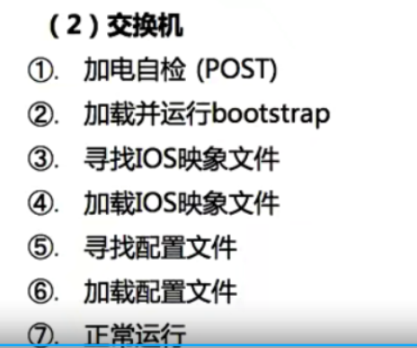
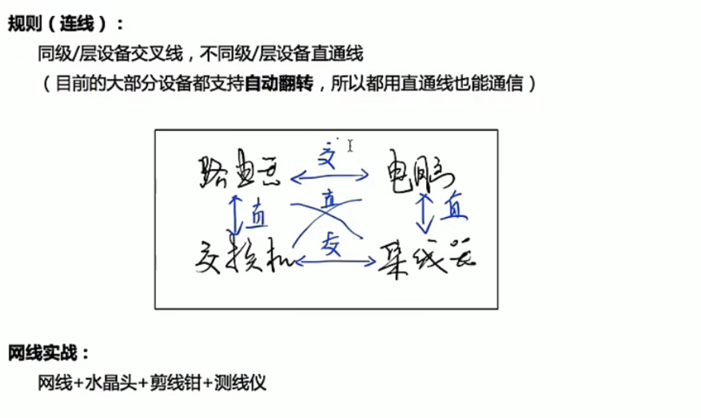
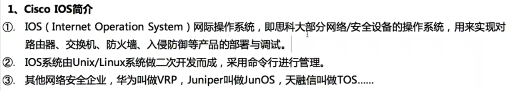
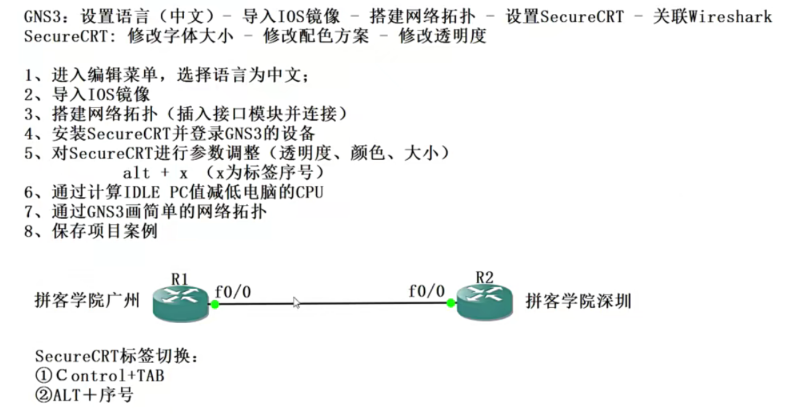
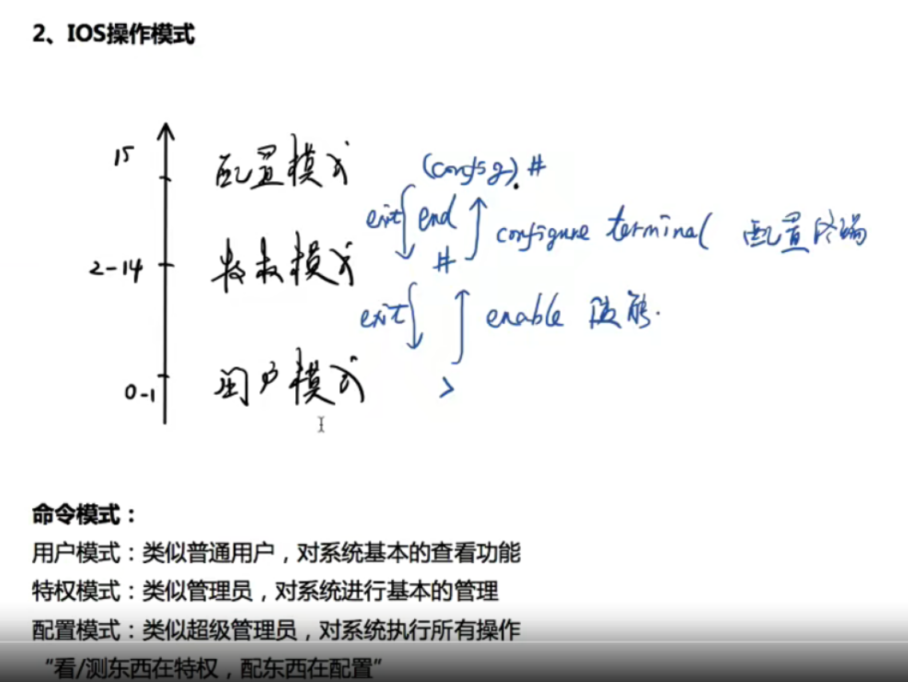

Tags:

1.管理密码<密码的配置及破解>

2.管理配置文件

3.管理IOS镜像文件

1、网络与安全企业

国外：思科(cisco)、Juniper(瞻博)、惠普、3Com、F5、Checkpoint

国内：华为、中兴、锐捷、H3C华三

绿盟科技、天融信、启明星辰、深信服、山石网科

网神、网康、联想网御，蓝盾科技，360企业安全

2、思科产品线

2.2设备硬件架构：

Tags:

1.路由器硬件架构

2.交换机硬件架构

3.设备启动流程

RAM:  内存

ROM：只读存储器，存储硬件指令

(1)ROM(read-only memory

功能：启动系统、密码恢复、系统升级或恢复

组成：

①Bootstrap程序：引导程序，用于引导加载操作系统

②Rommon程序：用于做密码恢复及系统升级

③POST程序：用于实现加电自检(power-on self-test)

(2)NVRAM

功能：放置配置文件+配置寄存器(configuration register)

配置寄存器的功能：用于影响路由器的启动流程（密码恢复）

0x2102:正常加载操作系统并加载配置文件

0x2142：正常加载操作系统但不加载配置文件

> **交换机没有NVRAM**

2.3 设备基础互联

Tags:

1、设备连接方式

2、设备连接线缆

1、设备连接方式

①近端管理（带外管理）

②远程管理（带内管理）

2、设备线缆

①光纤

单模光纤：速度快、距离远（几十公里）、黄色

多模光纤：速度慢、距离近（几公里）、橙色

②网线（以太网线)

分类：

根据是否屏蔽：屏蔽双绞线和非屏蔽双绞线UTP

根据线序类型：直通线和交叉线

线序：

568B:橙白 橙 绿白 蓝 蓝白 绿 棕白 棕

568A:绿白 绿 橙白 蓝 蓝白 橙 棕白 棕

1/2/3/6是实际通信网芯，其他做备份。

IOS 基础操作经历

# 工具安装

# IOS 操作模式

