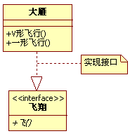

# 类图的基本介绍

类图的3个基本组件：类名、属性、方法。

类之间的关系

1. 泛化（generalization）

描述：也叫继承关系，在类图中使用带三角箭头的实线表示，箭头从子类指向父类。

1. 实现（Realization）

描述：在类图中就是接口和实现的关系。

1. 依赖（Dependency）

描述：对象之间最弱的一种关联方式。代码中一般指由局部变量、函数参数、返回值建立的对于其他对象的调用关系。简单的理解，类A使用到了另一个类B，而这种使用关系是具有偶然性的、临时性的、非常弱的，但是B类的变化会影响到A。在类图使用带箭头的虚线表示，箭头从使用类指向被依赖的类。

1. 关联（Association）

描述：是一种拥有的关系，它使一个类知道另一个类的属性和方法，关联可以是双向的，也可以是单向的。双向的关联可以有两个箭头或者没有箭头，单向的关联有一个箭头。箭头指向被拥有的类。

4.1. 聚合（Aggregation）

描述：聚合关系是关联关系的一种，是强关联关系，是整体和成员之间的关系，是 has-a 的关系。成员对象是整体对象的一部分，但是成员对象可以脱离整体对象而独立存在。

【代码体现】 ：成员变量

【箭头及指向】：带空心菱形的实心线，菱形指向整体

4.2 组合（Composition）

描述：组合关系也是关联关系的一种，也表示类之间的整体与部分的关系，但它是一种更强烈的聚合关系。在组合关系中，整体对象可以控制成员对象的生命周期，一旦整体对象不存在，成员对象也将不存在，成员对象不能脱离整体对象而存在。例如，头和嘴的关系，没有了头，嘴也就不存在了。

没有学校，也就不会有校长。

# 示例

举一个简单的例子，来看这样一副图，其中就包括了UML类图中的基本图示法。

首先，看动物矩形框，它代表一个类（Class）。类图分三层，第一层显示类的名称，如果是抽象类，则就用斜体显示。第二层是类的特性，通常就是字段和属性。第三层是类的操作，通常是方法或行为。前面的符号，+ 表示public，- 表示private，# 表示protected。

右下角的飞翔，它表示一个接口图，与类图的区别主要是顶端的<<interface>>显示。第一行是接口名称，第二行是接口方法。接口还有另一种表示方法，俗称棒棒糖表示法。唐老鸭是能讲人话的鸭子，实现了讲人话的接口。

接下来的是类与类，类与接口之间的关系了。首先注意动物、鸟、鸭、唐老鸭之间的关系符号。它们都是继承的关系，继承关系用空心三角形 + 实线来表示的。、

   上述所列举的几种鸟中，大雁最能飞，让它实现了飞翔接口。实现接口用空心三角形 + 虚线来表示。

   企鹅和气候两个类，企鹅是很特别的鸟，会游不会飞。更重要的是，它与气候有很大的关联。我们不去讨论为什么北极没有企鹅，为什么它们要每年长途跋涉。总之，企鹅需要知道气候的变化，需要了解气候规律。当一个类知道另一个类时，可以用关联（association）。关联关系用实线箭头来表示。

   再来看大雁和雁群这两个类，大雁是群居动物，每只大雁都是属于一个雁群，一个雁群可以有多只大雁。所以它们之间就满足聚合（Aggregation）关系。聚合表示一种弱的拥有关系，体现的是A对象可以包含B对象，但B对象不是A对象的一部分。聚合关系用空心的菱形 + 实线箭头来表示。

   组合（Composition）是一种强的拥有关系，体现了严格的部分和整体的关系，部分和整体的生命周期一样。在这里鸟和其翅膀就是组合关系，因为它们是部分和整体的关系，并且翅膀和鸟的生命周期是相同的。组合关系用实习的菱形 + 实线箭头来表示。另外，你会注意到合成关系的连线两端还有一个数字1和数字2，这被称为基数。表明这一端的类可以有几个实例，很显然，一个鸟应该有两只翅膀。如果一个类可能有无数个实例，则就是n来表示。关系关系、聚合关系也可以有基数的。

   动物的几大特征，比如有新陈代谢，能繁殖。而动物要有生命力，需要氧气、水以及食物等。也就是说，动物依赖于氧气和水。他们之间是依赖关系（Dependency），用虚线箭头来表示。

